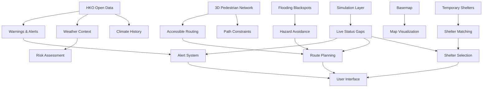

# PathGuard — Stage 1: Discovery and Requirements

**Labels used throughout**
- **[A]** Assumption, not yet confirmed
- **[H]** Hypothesis to test with real users
- **[U]** Unverified fact to check against a source before relying on it
- **[D]** Open decision requiring user input

---

## 1.1 Problem Statement

### Core Problem
Standard navigation systems optimize for the fastest route for able-bodied individuals. During urban emergencies (typhoons, floods, fire, infrastructure failures), routes that are fast for most people can be impossible or dangerous for people with mobility, sensory, or cognitive accessibility needs.

Obstacles include:
- Physical barriers: stairs, broken lifts, inaccessible entrances, flooded underpasses
- Path constraints: narrow or blocked footpaths, excessive slopes
- Shelter suitability: shelters lacking essential facilities (accessible toilets, power for medical devices)
- Communication barriers: single-channel audio alerts, complex text instructions

**Problem in one line:** People with accessibility needs cannot reliably determine which emergency shelter they can actually reach and enter, nor can they reliably receive or understand emergency warnings tailored to their needs.

Promise: "In an emergency, the nearest shelter means nothing if you cannot reach it."

### Context: Hong Kong's Emergency Landscape
Hong Kong faces regular typhoons (May–November), rainstorms, and urban flooding. While official systems provide general warnings and shelter lists, they lack personalization for accessibility needs and integrated accessible routing.

### Evidence Status
| Claim | Status | Source/Verification Required |
|-------|--------|-----------------------------|
| Standard route apps do not model stairs, lifts, flood depth and shelter accessibility together | [U] | Verify current capabilities of major navigation apps (Google Maps, Apple Maps, OpenStreetMap-based apps) |
| People with disabilities and older adults face higher risk in disasters | [U] | Cite published sources (UN, WHO, Hong Kong government reports) |
| Single-channel audio alerts exclude deaf and hard-of-hearing users | [H] | Validate through user research (Stage 2) |
| A farther accessible shelter is preferred over a nearer inaccessible one | [H] | Validate with users and emergency planners |

---

## 1.2 Goals and Non-Goals

### Goals
| ID | Goal | Measure (Targets to Validate) | Alignment with SDG 11 |
|----|------|-------------------------------|----------------------|
| G-1 | Deliver an alert the user can perceive and understand | 100% of participants per sensory group perceive the alert within 10 seconds of delivery in moderated tests | 11.5 (reduce disaster impact, protect vulnerable people) |
| G-2 | Recommend a shelter the user can actually reach and use | 0 recommendations in simulation tests violate hard accessibility constraints | 11.2 (accessible transport) |
| G-3 | Provide a route free of blocking barriers for the user's profile | 0 hard-blocked edges in any generated route across the test suite | 11.2 (accessible transport) |
| G-4 | Replan when conditions change | Reroute computed and shown within 3 seconds (p95) of triggering event | 11.5 (disaster resilience) |
| G-5 | Make help reachable when the user cannot act | Unacknowledged alert triggers caregiver escalation at configured delay, 100% of time in tests | 11.5 (protect vulnerable) |
| G-6 | Be usable by the target accessibility groups | Task completion rate and error rate thresholds agreed at Stage 3 UX review | 11.7 (accessible public spaces) |

### Non-Goals (MVP)
- **Not** replacing official emergency services, official warnings, or evacuation orders
- **Not** real-time integrations with hazard detection, transit, or building management systems
- **Not** native iOS or Android apps (web app with PWA install)
- **Not** indoor mapping for all buildings (only shelters and simulated key locations)
- **Not** guaranteeing physical safety (risk reduction tool, not safety guarantee)

---

## 1.3 Stakeholders

| Stakeholder | Primary Interest | Influence Level | Engagement Strategy |
|-------------|-----------------|-----------------|---------------------|
| **People with accessibility needs** | Safe, usable evacuation; tailored alerts | Primary | User research, co-design, usability testing |
| Wheelchair users | Step-free routes, lift availability, width constraints | High | Accessibility audits, mobility-focused testing |
| Older adults | Simplified instructions, larger text, reduced cognitive load | High | Age-friendly design review |
| Deaf/hard-of-hearing users | Non-audio alerts, visual/vibration notifications | High | Sensory accessibility testing |
| Blind/low-vision users | Screen reader compatibility, audio instructions, tactile cues | High | Screen reader testing |
| **Caregivers and family** | Know the person is safe, intervene when needed | High | Caregiver workflow testing |
| **Shelter operators** | Accurate capacity and facilities, avoid overload | High | Operational interviews, training materials |
| **Municipal emergency operators** | Situational awareness, trust in data | High | Stakeholder interviews, demo sessions |
| **Accessibility NGOs and disability groups** | Representation, standards compliance | Advisory | Consultative workshops, feedback sessions |
| **Community reporters** | Easy hazard reporting, trust in moderation | Medium | User testing of reporting flow |
| **Legal and privacy officers** | Special-category data handling, compliance | Gate holder | Privacy by design reviews, legal consultations |
| **Development team** | Feasible implementation, maintainable code | Technical | Technical design reviews, architecture sessions |

---

## 1.4 Scope

### In Scope (MVP)
1. **Accessibility profile and consent**: Mobility, sensory, cognitive, facility needs; guest quick start
2. **Accessible emergency alerts**: Multi-channel (visual, vibration, audio), WCAG-compliant, profile-driven
3. **Shelter matching**: Hard filters for accessibility, soft ranking with explanations
4. **Accessible routing**: Profile-aware routing on pedestrian network with hazard avoidance
5. **Dynamic rerouting**: Real-time replanning for changing conditions
6. **Hazard reporting and moderation**: Community reporting with verification
7. **Caregiver linking and escalation**: Consent-based sharing, timed escalation
8. **AI agent**: Coordinates tools, explains decisions, full fallback capability
9. **Simulation and console**: Scenario control, simulation banner
10. **Staff console**: Shelter status editing, hazard moderation, escalation queue

### Out of Scope (MVP, Candidate for Future)
- Live data feeds for all hazard types
- SMS and voice-call fallback notifications
- Multi-language beyond English and Traditional Chinese
- Crowd-sourced accessibility mapping at scale
- Integration with building management systems
- Indoor mapping beyond shelter facilities
- Real-time public transport integration

---

## 1.5 Assumptions and Constraints

### Assumptions
| ID | Assumption | Rationale | Verification Needed |
|----|------------|-----------|-------------------|
| A-1 | Pilot area is Hong Kong with typhoon/flood risk and public lift infrastructure | [A] Based on product brief | Confirm geographic scope |
| A-2 | MVP is a responsive web app (installable PWA) | [A] Matches brief "web app" | Confirm delivery platform |
| A-3 | Users have smartphones with modern browsers | [A] Required for PWA features | Define minimum specifications |
| A-4 | English first, Traditional Chinese as additional language | [A] Hong Kong context | Confirm language priorities |
| A-5 | Users or caregivers can complete profile setup | [A] Required for personalization | Validate in user testing |
| A-6 | All HKO open data is available for use | [A] Based on data source list | Verify license terms |

### Constraints
| ID | Constraint | Impact | Mitigation |
|----|------------|--------|------------|
| C-1 | Disability data is special-category under privacy laws | [U] Requires careful handling | Privacy by design, explicit consent, data separation |
| C-2 | Vibration API limited on iOS browsers | [U] Affects alert delivery | Provide visual alternatives |
| C-3 | Flashing content limits for seizure safety | [U] WCAG 2.3.1 (max 3 flashes/sec) | Design slow color pulses, not strobes |
| C-4 | Web Push on iOS requires installed PWA | [U] Affects notification delivery | Clear installation instructions |

---

## 1.6 Data Source Register

### Verified Data Sources

#### S1: Hong Kong Observatory (HKO) Open Data
| Item | Detail | Status |
|------|--------|--------|
| **What it gives** | Warnings, weather observations, climate history, tropical cyclone tracks | [U] Need to verify all data types |
| **What it lacks** | Shelter information, pedestrian network data, hazard reports | N/A |
| **License** | Open Government Data License v1.0 | [U] Verify specific terms |
| **Format** | API (JSON), CSV for historical data | Confirmed |
| **Update rate** | Warnings: real-time; Observations: 10-min; Climate: monthly | Confirmed |
| **Verification status** | Source confirmed, API documentation needs review | [U] Complete T-100 |

#### S2: Lands Department 3D Pedestrian Network
| Item | Detail | Status |
|------|--------|--------|
| **What it gives** | Footways, footbridges, subways, MTR unpaid areas, wheelchair-supporting footways, public lifts, gradient/height data | [U] Verify completeness |
| **What it lacks** | Real-time status (lifts, escalators), indoor routes | N/A |
| **License** | Open Government Data License v1.0 | [U] Verify specific terms |
| **Format** | GeoJSON, GML, FGDB | Confirmed |
| **Update rate** | Quarterly | [U] Verify update schedule |
| **Verification status** | Source confirmed, schema review needed | [U] Complete investigation |

#### S3: Drainage Services Department Flooding Blackspots
| Item | Detail | Status |
|------|--------|--------|
| **What it gives** | Static locations of known flood-prone areas | Confirmed |
| **What it lacks** | Real-time flood depth, dynamic flooding data | N/A |
| **License** | Open Government Data License v1.0 | [U] Verify specific terms |
| **Format** | API/CSV (data.gov.hk) | Confirmed |
| **Update rate** | Periodic (unspecified) | [U] Verify update frequency |
| **Verification status** | Source confirmed, API access needs testing | [U] Complete investigation |

#### S4: Home Affairs Department Temporary Shelters
| Item | Detail | Status |
|------|--------|--------|
| **What it gives** | Shelter locations, names, addresses | [U] Verify typhoon-specific list exists |
| **What it lacks** | Accessibility features, capacity, real-time status | Critical gap |
| **License** | Open Government Data License v1.0 | [U] Verify specific terms |
| **Format** | Likely CSV/API (data.gov.hk) | [U] Confirm format |
| **Update rate** | As needed (emergency declarations) | [U] Verify update mechanism |
| **Verification status** | Source uncertain, needs verification | [U] Critical verification needed |

#### S5: Basemap (Lands Department or CSDI)
| Item | Detail | Status |
|------|--------|--------|
| **What it gives** | Base mapping tiles for Hong Kong | [U] Confirm source |
| **What it lacks** | Accessibility annotations | N/A |
| **License** | Government terms of use | [U] Verify commercial use |
| **Format** | WMTS/XYZ tiles | [U] Confirm technical details |
| **Update rate** | Regular updates | [U] Confirm schedule |
| **Verification status** | Source not confirmed | [D-12] Decision needed |

### Data Gaps (To Be Designed Around)
| Gap | Consequence | Design Approach |
|-----|-------------|-----------------|
| **Live lift/escalator status** | Cannot detect real-time failures | Simulated status layer with persistent "SIMULATION" marker |
| **Shelter capacity (real-time)** | Cannot know when shelters are full | Simulated capacity with manual staff updates |
| **Shelter accessibility features** | Cannot filter by specific needs | Manual data collection + simulation |
| **Road closures and live hazards** | Cannot avoid actual blocked paths | Community reporting + simulation |
| **Indoor building layouts** | Cannot route inside shelters | Simplified indoor modeling for key facilities |

### Data Source Relationships

---

## 1.7 Functional Requirements

Format: `FR-{CATEGORY}-{ID}` where category is: PRF (Profile), ALR (Alerts), SHL (Shelter), RTE (Routing), RRT (Rerouting), HZD (Hazard), CGV (Caregiver), AGT (Agent), SIM (Simulation), OPS (Operations).

### A. Accessibility Profile and Consent (PRF)
| ID | Requirement | Acceptance Criteria | Priority | Goal |
|----|-------------|-------------------|----------|------|
| FR-PRF-01 | User can create an accessibility profile | Given a new user, they can specify mobility, sensory, cognitive, and facility needs within 5 minutes | M | G-6 |
| FR-PRF-02 | Profile includes mobility constraints | Given wheelchair user, system records type, stairs capability, max slope, min width, kerb limits | M | G-3 |
| FR-PRF-03 | Profile includes sensory needs | Given deaf user, alerts never rely solely on audio | M | G-1 |
| FR-PRF-04 | Profile includes cognitive/language needs | Given simplified mode, instructions use ≤12 words per step | M | G-1 |
| FR-PRF-05 | Profile includes facility requirements | Given medical power need, shelters without power are excluded | M | G-2 |
| FR-PRF-06 | Guest quick start available | Given no account, user can specify immediate needs for one-time use | S | G-6 |
| FR-PRF-07 | Full account deletion | Given delete request, all personal data removed within 30 days | M | Privacy |
| FR-PRF-08 | Caregiver-assisted profile setup | Given caregiver session, consent record stored with actor info | S | G-6 |

### B. Accessible Emergency Alerts (ALR)
| ID | Requirement | Acceptance Criteria | Priority | Goal |
|----|-------------|-------------------|----------|------|
| FR-ALR-01 | Multi-channel alert delivery | Given alert, delivers via visual, vibration, audio based on profile | M | G-1 |
| FR-ALR-02 | WCAG-compliant visual alerts | Given visual alert, uses ≤3 flashes/sec, high contrast, clear icons | M | G-1 |
| FR-ALR-03 | Alert acknowledgment required | Given alert, user must tap "OK" or "Need help" to proceed | M | G-5 |
| FR-ALR-04 | Escalation for unacknowledged alerts | Given no response in 3 minutes, alerts caregivers | M | G-5 |
| FR-ALR-05 | Alert history viewable | Given user, can see last 30 days of alerts with status | S | G-6 |
| FR-ALR-06 | Speech repetition on demand | Given "Read aloud" button, speaks full instructions | M | G-1 |

### C. Shelter Matching (SHL)
| ID | Requirement | Acceptance Criteria | Priority | Goal |
|----|-------------|-------------------|----------|------|
| FR-SHL-01 | Hard filters for accessibility | Given wheelchair user, excludes shelters without step-free entry | M | G-2 |
| FR-SHL-02 | Soft ranking with explanation | Given candidates, shows score breakdown (route time, risk, capacity, facilities) | M | G-2 |
| FR-SHL-03 | Uses accessible route time, not distance | Given two shelters, farther reachable one ranks higher than nearer inaccessible | M | G-2 |
| FR-SHL-04 | Capacity-aware ranking | Given shelter at capacity, drops from recommendations | M | G-4 |
| FR-SHL-05 | "Why this shelter" explanation | Given recommendation, shows rejected nearer shelters with failing constraints | M | Trust |
| FR-SHL-06 | Alternative shelter choices | Given recommendation, shows ≥2 alternatives when available | M | G-6 |

### D. Accessible Routing (RTE)
| ID | Requirement | Acceptance Criteria | Priority | Goal |
|----|-------------|-------------------|----------|------|
| FR-RTE-01 | Profile-specific hard blocks | Given wheelchair user, blocks stairs, narrow paths, excessive slopes | M | G-3 |
| FR-RTE-02 | Hazard-aware routing | Given flood blackspot, avoids or penalizes affected edges | M | G-3 |
| FR-RTE-03 | Unknown data policy | Given unverified edge, blocks for wheelchair unless user opts in | M | Safety |
| FR-RTE-04 | Step-by-step instructions | Given route, provides clear text, icons, map segments | M | G-6 |
| FR-RTE-05 | "No route" handling | Given no safe route, shows clear message and help request | M | G-5 |
| FR-RTE-06 | Rest point inclusion | Given long route, includes known rest points with seating/cover | C | G-3 |

### E. Dynamic Rerouting (RRT)
| ID | Requirement | Acceptance Criteria | Priority | Goal |
|----|-------------|-------------------|----------|------|
| FR-RRT-01 | Real-time hazard monitoring | Given active route, recomputes within 3s when hazard intersects | M | G-4 |
| FR-RRT-02 | Position-based rerouting | Given position update, starts from nearest valid network node | M | G-4 |
| FR-RRT-03 | Clear change explanation | Given reroute, shows reason and first new step in user's alert mode | M | G-1 |
| FR-RRT-04 | Shelter availability changes | Given shelter becomes full, selects new destination with explanation | M | G-4 |

### F. Hazard Reporting (HZD)
| ID | Requirement | Acceptance Criteria | Priority | Goal |
|----|-------------|-------------------|----------|------|
| FR-HZD-01 | Simple 3-step reporting | Given reporter, completes report in ≤30 seconds | M | G-6 |
| FR-HZD-02 | Trust scoring system | Given unverified report, applies temporary penalty; staff verification upgrades | M | Safety |
| FR-HZD-03 | Hazard expiration | Given old hazard, flags for reconfirmation after TTL | M | Safety |
| FR-HZD-04 | Staff verification queue | Given pending reports, staff can verify/reject/resolve | M | Trust |
| FR-HZD-05 | Abuse controls | Given false reports, reduces trust score, applies rate limits | S | Safety |

### G. Caregiver Support (CGV)
| ID | Requirement | Acceptance Criteria | Priority | Goal |
|----|-------------|-------------------|----------|------|
| FR-CGV-01 | Consent-based linking | Given caregiver link, only shows consented data fields | M | Privacy |
| FR-CGV-02 | Timed escalation ladder | Given no acknowledgment, escalates through configured steps | M | G-5 |
| FR-CGV-03 | Caregiver dashboard | Given active evacuation, shows status, location, route within 5s | M | G-5 |
| FR-CGV-04 | "I need help" button | Given help request, notifies caregivers with location | M | G-5 |
| FR-CGV-05 | Sharing pause control | Given pause request, stops location sharing immediately | M | Privacy |

### H. AI Agent (AGT)
| ID | Requirement | Acceptance Criteria | Priority | Goal |
|----|-------------|-------------------|----------|------|
| FR-AGT-01 | Tool coordination | Given emergency, produces plan with tool call record | M | G-2 |
| FR-AGT-02 | Safety-critical deterministic engines | Given any recommendation, hard constraints enforced by code, not model | M | Safety |
| FR-AGT-03 | Fallback without model | Given model unavailable, produces rules-based plan | M | Safety |
| FR-AGT-04 | Plain language explanations | Given decision, explains in ≤3 sentences (simplified mode) | M | Trust |
| FR-AGT-05 | Action tagging | Given actions, tags as autonomous, confirm-first, or forbidden | M | Safety |
| FR-AGT-06 | Prompt injection defense | Given hazardous input, treats as data, cannot change tool use | M | Security |

### I. Simulation and Staff Console (SIM/OPS)
| ID | Requirement | Acceptance Criteria | Priority | Goal |
|----|-------------|-------------------|----------|------|
| FR-SIM-01 | Clear simulation labeling | Given simulation mode, shows persistent "SIMULATION" banner | M | Safety |
| FR-SIM-02 | Scenario control | Given operator, can inject events (lift failure, flood, shelter full) | M | Demo |
| FR-OPS-01 | Shelter status editor | Given staff, can update shelter status with audit trail | M | G-2 |
| FR-OPS-02 | Hazard moderation queue | Given staff, can verify/reject/resolve hazard reports | M | Trust |
| FR-OPS-03 | Escalation queue | Given staff, sees users needing help with location/contact | M | G-5 |

---

## 1.8 Non-Functional Requirements

### Accessibility (ACC)
| ID | Requirement | Verification Method | WCAG Reference |
|----|-------------|-------------------|----------------|
| NFR-ACC-01 | WCAG 2.2 Level AA compliance | Automated scan + manual audit | Full standard |
| NFR-ACC-02 | Keyboard, screen reader, voice control operable | Manual test script | 2.1.1 Keyboard |
| NFR-ACC-03 | 48px touch targets (emergency flow) | Design review, device test | 2.5.5 Target Size |
| NFR-ACC-04 | Respect OS accessibility settings | Test matrix | 1.3.5 Identify Input Purpose |
| NFR-ACC-05 | No reliance on color alone | Review checklist | 1.4.1 Use of Color |
| NFR-ACC-06 | ≤3 flashes/second for visual alerts | Design review, testing | 2.3.1 Three Flashes |

### Performance (PER)
| ID | Requirement | Target | Measurement |
|----|-------------|--------|-------------|
| NFR-PER-01 | First meaningful paint (alert screen) | <2s on mid-range phone/4G | Lighthouse, device lab |
| NFR-PER-02 | Route computation time | <1s p95 | Load testing |
| NFR-PER-03 | Reroute computation time | <3s p95 end-to-end | Load testing |
| NFR-PER-04 | Alert fan-out to 10k users | <30s | Load testing |

### Reliability (REL)
| ID | Requirement | Implementation | Verification |
|----|-------------|----------------|-------------|
| NFR-REL-01 | Offline cached route availability | Service worker caching | Offline testing |
| NFR-REL-02 | Graceful degradation | Fallback modes for failed services | Fault injection |
| NFR-REL-03 | Availability during emergencies | 99.9% (simulated) | Monitoring |

### Security and Privacy (SEC/PRV)
| ID | Requirement | Implementation | Verification |
|----|-------------|----------------|-------------|
| NFR-SEC-01 | Authentication/authorization | Role-based access control | Security tests |
| NFR-SEC-02 | Input validation/output encoding | Sanitization libraries | Security scanning |
| NFR-PRV-01 | Special-category data separation | Separate storage, access logs | Privacy review |
| NFR-PRV-02 | Data minimization | Collect only needed data | Design review |
| NFR-PRV-03 | Explicit consent records | Granular consent per data use | Audit testing |

### Compatibility (COM)
| ID | Requirement | Scope | Verification |
|----|-------------|-------|-------------|
| NFR-COM-01 | Browser compatibility | Latest 2 versions of Chrome, Safari, Firefox, Edge | Test matrix |
| NFR-COM-02 | Mobile browser support | Android Chrome, iOS Safari | Device testing |
| NFR-COM-03 | PWA installability | Meets PWA criteria | Lighthouse PWA audit |

---

## 1.9 Roles and Permissions

```mermaid
graph TB
    subgraph "User Roles"
        A[End User] --> A1[Guest User]
        A --> A2[Registered User]
        A --> A3[Caregiver]
        
        B[Staff] --> B1[Shelter Operator]
        B --> B2[Hazard Moderator]
        B --> B3[Escalation Responder]
        
        C[Admin] --> C1[System Administrator]
        C --> C2[Simulation Controller]
    end
    
    subgraph "Permissions Matrix"
        P1[Create/Edit Profile] --> A2
        P1 --> A3
        
        P2[Report Hazards] --> A2
        P2 --> B1
        P2 --> B2
        
        P3[View Caregiver Dashboard] --> A3
        
        P4[Edit Shelter Status] --> B1
        
        P5[Moderate Hazards] --> B2
        
        P6[Respond to Escalations] --> B3
        
        P7[Control Simulations] --> C2
        
        P8[System Configuration] --> C1
    end
```

### Detailed Permissions
| Role | Permissions | Restrictions |
|------|-------------|--------------|
| **Guest User** | - Quick-start profile - One-time route planning - View alerts | No data persistence, no caregiver features |
| **Registered User** | - Full profile management - Alert history - Hazard reporting - Caregiver linking | Own data only, no system-wide access |
| **Caregiver** | - View linked user status/location/route - Receive escalation notifications - Send check-ins | Only for linked users with consent |
| **Shelter Operator** | - Update shelter status/capacity - View shelter analytics | Only assigned shelters |
| **Hazard Moderator** | - Verify/reject/resolve hazard reports - View reporter trust scores | Cannot edit shelter data |
| **Escalation Responder** | - View escalation queue - Contact users/caregivers - Mark escalations resolved | Cannot modify system configuration |
| **Simulation Controller** | - Inject simulation events - Control scenario playback - View simulation metrics | Production data access limited |
| **System Administrator** | - User management - System configuration - Audit log access | Full system access |

---

## 1.10 Success Metrics

### Product Success Metrics
| Metric | Target | Measurement Method | Timeline |
|--------|--------|-------------------|----------|
| Alert perception rate | 100% across sensory groups | Moderated user testing | Post-MVP |
| Shelter recommendation accuracy | 0 hard constraint violations | Simulation test suite | Continuous |
| Route safety compliance | 0 hard-blocked edges | Automated route validation | Continuous |
| Reroute response time | <3s p95 | Performance monitoring | Continuous |
| Escalation reliability | 100% in tests | Automated test suite | Continuous |
| Task completion rate | TBD at Stage 3 | Usability testing | Post-MVP |

### Technical Success Metrics
| Metric | Target | Measurement Method |
|--------|--------|-------------------|
| System availability | 99.9% | Uptime monitoring |
| API response time | <200ms p95 | Application monitoring |
| Route computation time | <1s p95 | Performance testing |
| Data freshness (alerts) | <1 minute from source | Ingestion monitoring |
| Cache hit rate (offline) | >90% for last route | Analytics |

### User Success Metrics
| Metric | Target | Measurement Method |
|--------|--------|-------------------|
| Profile completion rate | >80% of registered users | Analytics |
| Alert acknowledgment rate | >90% within 5 minutes | Analytics |
| Caregiver linking rate | >50% of users with caregivers | Analytics |
| Hazard report accuracy | >80% verified reports | Moderation analytics |
| User satisfaction score | >4/5 (TBD) | Post-use surveys |

---

## 1.11 Deliverables List

### Stage 1 Deliverables (This Document)
1. ✅ Problem statement
2. ✅ Goals and non-goals
3. ✅ Stakeholder analysis
4. ✅ Scope definition
5. ✅ Assumptions and constraints
6. ✅ Data source register
7. ✅ Functional requirements
8. ✅ Non-functional requirements
9. ✅ Roles and permissions
10. ✅ Success metrics
11. ✅ Deliverables list
12. ✅ Contradictions and gaps
13. ✅ Risks assessment
14. ✅ Decisions needed

### Subsequent Stage Deliverables (Planned)
| Stage | Key Deliverables | Review Gate |
|-------|-----------------|-------------|
| **Stage 2** | User research plan, proto-personas, user journeys, storyboards | G2 Journey Review |
| **Stage 3** | Information architecture, page specifications, UI designs, content rules | G3 UX Review |
| **Stage 4** | Technical architecture, system components, database schema, API design | G4 Architecture Review |
| **Stage 5** | Implementation plan, test strategy, task breakdown, demo script | G5 Build-Readiness |

---

## 1.12 Contradictions and Missing Information

### Contradictions
| Contradiction | Impact | Resolution Needed |
|---------------|--------|-------------------|
| **Data constraint vs. feature set** | Brief specifies full feature set but data sources lack shelter accessibility and pedestrian network details | [D] Decide: Simulate missing data with clear labeling or defer features |
| **Real-time requirements vs. data latency** | Dynamic rerouting needs real-time hazard data, but sources are static or periodic | [D] Decide: Use community reporting + simulation for real-time gaps |
| **Accessibility compliance vs. technical constraints** | Certain WCAG requirements may conflict with platform limitations (iOS vibration) | [D] Decide: Accept limitations with fallbacks or find alternatives |

### Missing Information
| Information Gap | Impact | Action Required |
|-----------------|--------|----------------|
| **Shelter accessibility data** | Cannot implement shelter filtering without facility details | [U] Verify if HAD shelter data includes accessibility fields; if not, plan manual collection |
| **Pedestrian network completeness** | Routing accuracy depends on network coverage and attribute completeness | [U] Verify 3D Pedestrian Network coverage and attribute schema |
| **HKO API rate limits** | Alert freshness depends on polling frequency | [U] Review HKO API documentation for rate limits |
| **Basemap licensing terms** | Cannot display maps without confirmed license | [D-12] Select and verify basemap source |
| **Legal jurisdiction for privacy** | Special-category data handling requirements vary by jurisdiction | [D-1] Confirm applicable privacy laws |

---

## 1.13 Risks Assessment

### High Risk
| Risk | Probability | Impact | Mitigation Strategy |
|------|------------|--------|-------------------|
| **Data source availability** | Medium | High | Regular monitoring, fallback simulations, clear labeling |
| **Accessibility compliance gaps** | Medium | High | Early accessibility testing, expert review, iterative refinement |
| **Real-time performance issues** | Medium | High | Performance testing from MVP, optimization priorities |
| **Privacy/security breaches** | Low | Critical | Privacy by design, security reviews, penetration testing |

### Medium Risk
| Risk | Probability | Impact | Mitigation Strategy |
|------|------------|--------|-------------------|
| **User adoption barriers** | High | Medium | Co-design with target users, simplified onboarding |
| **Caregiver network effects** | Medium | Medium | Easy invitation flows, clear value proposition |
| **Staff training requirements** | Medium | Medium | Clear documentation, training materials, support channels |
| **Technical complexity (AI agent)** | High | Medium | Phased implementation, fallback modes, simplified MVP |

### Low Risk
| Risk | Probability | Impact | Mitigation Strategy |
|------|------------|--------|-------------------|
| **Browser compatibility issues** | Low | Low | Progressive enhancement, feature detection |
| **Map visualization performance** | Low | Low | Tile optimization, lazy loading |
| **Localization complexity** | Low | Low | Externalized strings from start, professional translation |

---

## 1.14 Decisions Needed from Product Owner

### Critical Decisions (Blocking)
| Decision ID | Question | Options | Recommendation |
|-------------|----------|---------|----------------|
| **D-1** | Which privacy laws apply? | Hong Kong PDPO, GDPR (if EU users), other | Assume Hong Kong PDPO + GDPR principles for future-proofing |
| **D-2** | Data strategy for missing shelter accessibility? | 1. Simulate with clear labels 2. Defer shelter matching 3. Manual data collection | Option 1 + 3: Simulate with labels, plan manual collection |
| **D-3** | Basemap source selection? | 1. Lands Department 2. OpenStreetMap 3. Commercial provider | Option 1 (official) with OSM fallback if licensing unclear |
| **D-4** | Staff role assignment model? | 1. Dedicated roles per shelter 2. Geographic zones 3. Organization-based | Option 2: Geographic zones for scalability |

### Important Decisions (Guidance Needed)
| Decision ID | Question | Options | Notes |
|-------------|----------|---------|-------|
| **D-5** | Alert escalation timing? | 3min, 5min, 10min, configurable | Start with 3min default, configurable per user |
| **D-6** | Hazard trust scoring thresholds? | N=3 confirmations, staff override, hybrid | Start with N=3 + staff override |
| **D-7** | Offline data retention period? | 24h, 48h, 7 days, configurable | 24h default, configurable up to 7 days |
| **D-8** | Simulation mode access control? | Anyone, authenticated users, staff only | Staff only for safety |

### Technical Decisions (Architecture Input)
| Decision ID | Question | Options | Technical Implications |
|-------------|----------|---------|----------------------|
| **D-9** | AI agent implementation approach? | 1. Local model 2. Cloud API 3. Rules-only fallback | Option 2 with 3 as fallback |
| **D-10** | Real-time update mechanism? | 1. WebSockets 2. Server-Sent Events 3. Polling | Option 1 for critical, 2 for updates |
| **D-11** | Database architecture? | 1. Single PostgreSQL 2. Specialized dbs 3. Hybrid | Option 1 with extensions (PostGIS, timescale) |
| **D-12** | Map rendering library? | 1. MapLibre GL JS 2. Leaflet 3. Commercial | Option 1 (open source, good performance) |

---

## Next Steps

1. **Review and Approve** this Stage 1 document
2. **Provide decisions** on critical items (D-1 through D-4)
3. **Authorize progression** to Stage 2 (User Research and Journeys)

**Review Gate G1**: Requirements review complete. Awaiting approval to proceed to Stage 2.

---
*Document version: 1.0*  
*Created: [Current Date]*  
*Status: For Review*  

**Traceability**: All requirements trace back to original product brief features and SDG 11 alignment.
