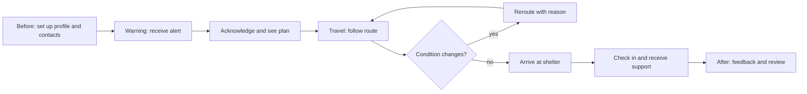
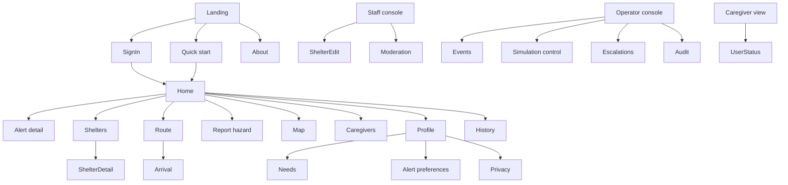
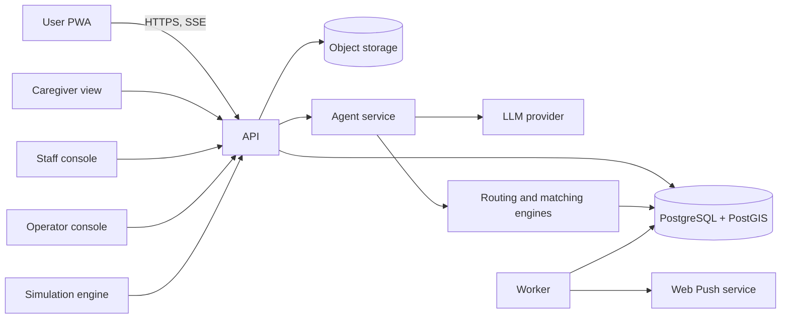
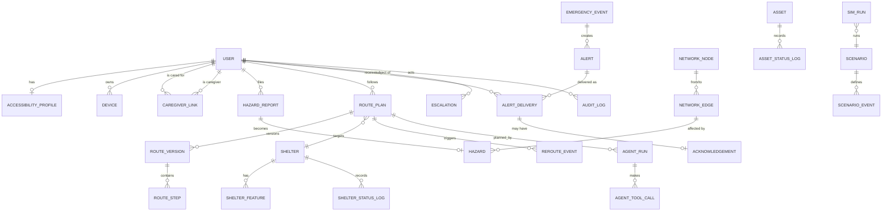
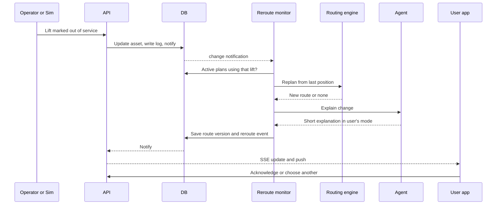

# PathGuard — Product, UX and Engineering Plan

> Temporary planning document for a separate project. Not part of LedgerAI. Delete this folder (`_delete-later/`) when the PathGuard repository is created.
> Status: Planning only. No code. Five stages, each ending at a review gate.

**Labels used throughout**
- **[A]** Assumption, not yet confirmed. **[H]** Hypothesis to test with real users. **[U]** Unverified fact to check against a source before relying on it. **[D]** Open decision.
- Nothing here is research evidence. No interviews, analytics, competitor capabilities or test results are claimed.

---

## 0. Summary

| Item | Value |
|---|---|
| Product | PathGuard, accessible emergency navigation |
| Form | Responsive web app, installable PWA, plus a staff/admin console |
| SDG | 11, Sustainable Cities and Communities. Relevant targets: 11.5 (reduce disaster impact, protect people in vulnerable situations), 11.2 (accessible transport for persons with disabilities and older persons), 11.7 (accessible public spaces) [U: confirm wording on un.org] |
| Core promise | "In an emergency, the nearest shelter means nothing if you cannot reach it." |
| MVP data | **Only two sources** (owner decision): the Marine Department typhoon shelters dataset and Hong Kong Observatory open data. See section 0.1. No synthetic city map |
| Primary users | Wheelchair users, older adults, people who are deaf or hard of hearing, blind or low-vision people, and their caregivers |
| Secondary users | Shelter staff, municipal emergency operators, community reporters |

### Stage map


| Stage | Name | Output | Gate |
|---|---|---|---|
| 1 | Discovery and requirements | Problem, goals, scope, functional and non-functional requirements | G1 Requirements review |
| 2 | User research and journeys | Research plan, hypotheses, proto-personas, journeys, storyboards | G2 Journey review |
| 3 | Information architecture and UI | Sitemap, page specs, states, alert design, content rules | G3 UX review |
| 4 | Technical architecture | Stack, components, schema, API, security, agent and routing design | G4 Architecture review |
| 5 | Implementation and validation | Task breakdown, test strategy, traceability, demo script, risks | G5 Build-readiness review |

Rule: stage N+1 does not start until the gate for stage N is approved.

---

## 0.1 Data constraint (binding; supersedes any conflicting text below)

**Owner decision:** use only (1) the Marine Department "Typhoon Shelters" dataset on data.gov.hk and (2) Hong Kong Observatory (HKO) open data. No other data, and no synthetic city map.
**Shelter handling decision:** the typhoon shelter dataset is used as marine map context. Human evacuation shelters are out of the plan until a source exists.

### Source S1. Marine Department typhoon shelters

| Item | Status |
|---|---|
| Resource | data.gov.hk resource `fab4e8a7-148b-4827-a73d-5e3bc168d7ad`, dataset `hk-md-hydro-typhoon-shelters`; CSDI Geoportal dataset id `mardep_rcd_1730971403590_9667` |
| Publisher, category | Marine Department, Transportation. Verified from the page |
| Description | "The location of the Typhoon Shelters (CSDI Portal)". Verified |
| Format, update | Listed as "API"; updated "as and when there is update"; last updated 2025-06-24. Verified |
| Fields, coordinate system, licence, record count | Not stated on the page. **[U]** Inspect the API response (task T-101) |
| Purpose | **[U] Likely sheltered water for vessels, not a place for people.** The page does not say. Secondary search results (a Legislative Council reply) describe 14 typhoon shelters with 419 hectares of sheltered space, and say the department does not track vessels moored in them. Confirm from the API schema and the Marine Department before any user-facing wording |

Use in PathGuard: a map layer of marine typhoon shelter locations (coastal context, useful for harbour and waterfront hazard awareness). It is never shown as a place a person can evacuate to.

### Source S2. Hong Kong Observatory open data

| Item | Detail |
|---|---|
| Live API | Base `https://data.weather.gov.hk/weatherAPI/opendata/weather.php` with `dataType` and `lang` parameters. Only `flw` (local weather forecast) was confirmed in the documentation links. **[U]** Confirm other data types (for example warning summary, warning information, current regional weather, forecast) against the HKO API documentation PDF |
| Warnings | Weather warning information, weather warning summary, special weather tips: update as and when warnings change (data.gov.hk listings). Tropical cyclone track information: as and when updated. Verified on HKO's open data page |
| Regional observations | Regional weather (station level, provisional) every 10 minutes; rainfall in the past hour from automatic weather stations every 15 minutes. Verified on HKO's open data page |
| Climate (history) | Monthly-updated daily series: temperature, rainfall, humidity, pressure, sunshine, wind speed and direction, sea temperature, cloud, lightning, and others. Daily rainfall provides per-station CSV: `https://data.weather.gov.hk/weatherAPI/cis/csvfile/{CODE}/ALL/daily_{CODE}_RF_ALL.csv` (25 stations) plus a current-year file. Start year, columns and licence: **[U]** read the data dictionary PDF |
| Tropical cyclone history | Best track data, post-analysed, updated yearly |
| Stations | Network of weather stations (CSDI spatial dataset) for station coordinates |
| Terms | **[U]** Read the data.gov.hk terms and the HKO readme; confirm attribution and rate-limit rules before release |

**[A-6]** The owner said "HK Observatory climate data". This plan treats all HKO open data (warnings, observations, tropical cyclone data, climate) as approved. **[D-11] Confirm**, otherwise limit to the climate series only.

### What these sources cannot provide

| Missing for the original idea | Consequence |
|---|---|
| Locations, accessibility features and capacity of shelters for people | No shelter matching for people |
| Pedestrian network (stairs, ramps, slope, width, kerbs) | No accessibility-aware routing |
| Lift and escalator status | No lift-failure rerouting |
| Flood depth, road closures, blocked paths | Only user reports (advisory) and weather indicators |
| Building entrances and indoor layouts | None |
| User position | From the device only, with consent |

A basemap is also needed to show a map. Map tiles are not one of the two sources. **[D-12]** Decide whether an open basemap is allowed as presentation only, or whether the map is drawn from the CSDI-served layers.

### Capability status under the constraint

| Capability | Status | How it works with the two sources |
|---|---|---|
| Accessible, personalised alerts | **Available, real** | Triggered by HKO warnings; adapted to the user's profile |
| Profile and consent | Available | Unchanged |
| Caregiver escalation | Available | Unchanged |
| Hazard reporting | Available, advisory only | User reports are app-generated, not a third data source (**[A-7]** confirm). Without a network they cannot change a route; they appear on the map and in the operator queue |
| Weather and climate risk context | **Available, real** | Current warnings, regional observations, rainfall in the past hour from the nearest station, and "how unusual is this" using historical daily CSVs |
| Marine typhoon shelter layer | Available | Section S1 |
| AI agent | Reduced | Coordinates the available tools only; reports clearly when shelter or route tools are unavailable |
| Shelter matching for people | **Deferred (no data)** | Needs a shelter source |
| Accessibility-aware routing | **Deferred (no data)** | Needs a pedestrian network |
| Dynamic rerouting | **Deferred (no data)** | Depends on routing |
| Scenario simulation | Changed | Replay of real HKO history (tropical cyclone best track, daily climate) instead of a synthetic city. A labelled demo warning is a decision: **[D-13]** allow a clearly labelled demo warning, or replay only |

### Revised MVP statement

PathGuard MVP proves personalised, multi-channel typhoon and rainstorm warnings driven by live HKO data, with acknowledgement and caregiver escalation, plus local weather risk context. The architecture keeps shelter, routing and rerouting as defined interfaces so they can be added when a suitable data source is approved. The value proposition "the nearest shelter means nothing if you cannot reach it" is **not demonstrable** in the MVP and must not be claimed.

### Supersession map (read this before using later sections)

| Section or item | Status |
|---|---|
| Goals G-2, G-3, G-4 | Deferred |
| FR-SHL-01 to FR-SHL-09 | Deferred, except marine layer display (new FR-MAR-01) |
| FR-RTE-01 to FR-RTE-10 | Deferred |
| FR-RRT-01 to FR-RRT-07 | Deferred |
| FR-HZD-* | Kept, advisory effect only (no route impact) |
| FR-AGT-01 | Plan steps limited to available tools |
| FR-SIM-01 to FR-SIM-04 | Replaced by historical replay and labelled demo warning (new FR-DAT-06) |
| Journeys J3, J4, J5, J8 | Deferred. J1, J2, J6, J7, J9 (marine layer only), J10 stay |
| Pages P7, P8, P9, P10, P18 | Deferred. P5 shows weather status, warnings and the marine layer; P11 map shows the marine layer, hazards and station observations |
| Tables: `network_nodes`, `network_edges`, `assets`, `asset_status_log`, `shelters`, `shelter_features`, `shelter_status_log`, `hazard_edge_impacts`, `route_plans`, `route_versions`, `route_steps`, `reroute_events` | Deferred; do not create in MVP migrations |
| Sections 4.6 and 4.7 (routing and matching design) | Kept as future design, not built |
| Tasks T-010 to T-013, T-030 to T-035, T-040 to T-043, T-080 | Deferred. Replaced by the ingestion tasks below |
| Demo script (5.6) | Replaced by the revised demo below |

### New requirements

| ID | Requirement | Acceptance criteria | Pri |
|---|---|---|---|
| FR-DAT-01 | Ingest HKO warnings on a schedule | Given a warning change at HKO, then PathGuard has it within 2 polling intervals (interval to be set within HKO's limits **[U]**) | M |
| FR-DAT-02 | Map each HKO warning to an internal emergency event (type, severity, text, onset, source link) | Given any current warning, then an internal event exists with its original HKO text preserved and mapping table versioned | M |
| FR-DAT-03 | Show data source, update time and age on every weather-driven screen | Given any weather status, then source name and time are visible and read by screen readers | M |
| FR-DAT-04 | Degrade safely when HKO is unreachable | Given an API failure, then the last good data is shown with an "outdated" label and no alert is invented | M |
| FR-DAT-05 | Climate context from historical CSVs: how unusual today's rainfall, wind or temperature is for the nearest station and month | Given a station and value, then the percentile is computed from the stored history and labelled "historical, not a forecast" | S |
| FR-DAT-06 | Replay mode using real historical records, and an optional labelled demo warning | Given replay, then the SIMULATION banner shows and no demo event reaches real users | M |
| FR-DAT-07 | Nearest-station lookup using HKO station coordinates | Given a location, then the nearest relevant station is chosen and shown | S |
| FR-DAT-08 | Attribution and licence text shown as required | Given the About page, then source credits match the licence terms | M |
| FR-MAR-01 | Show marine typhoon shelter locations on the map with a plain label "Shelter for boats (Marine Department)" once confirmed | Given the layer, then it is never offered as a destination for people | M |
| FR-MAR-02 | Refresh the marine layer when the source updates | Given a new source version, then the layer updates and the version is recorded | S |

### New and changed tables (replace the deferred ones)

| Table | Purpose | Key columns |
|---|---|---|
| `ingestion_runs` | Audit of every pull | id, source (hko_api, hko_csv, mardep_csdi), started_at, finished_at, status, http_status, records, source_version, error |
| `hko_warning_snapshots` | Raw and parsed warnings | id, fetched_at, data_type, language, raw jsonb, parsed jsonb, content_hash (unique with data_type) |
| `hko_stations` | Station reference | code (PK), name_en, name_zh, geom Point, source_dataset, valid_from |
| `hko_regional_observations` | 10-minute and rainfall-in-past-hour readings | station_code, observed_at, metric, value, unit, fetched_at. PK (station_code, observed_at, metric) |
| `hko_climate_daily` | Imported daily series | station_code, date, metric, value, quality_flag, source_file, imported_at. PK (station_code, date, metric) |
| `tc_track_points` | Tropical cyclone tracks (best track and current) | cyclone_id, observed_at, geom Point, intensity, source (best_track, current) |
| `marine_typhoon_shelters` | Marine Department layer | id, name_en, name_zh, geom (Geometry), attributes jsonb (as received), source_version, imported_at |
| `emergency_events` | Same table as Stage 4, plus `source = hko` and `source_ref` to the snapshot | |

Indexes: GIST on `hko_stations.geom`, `marine_typhoon_shelters.geom`, `tc_track_points.geom`; B-tree on `(station_code, observed_at desc)` for observations; unique `(data_type, content_hash)` for snapshots. Retention: snapshots 90 days, observations 30 days, climate history permanent, tracks permanent.

### New components and tasks

Components: scheduled ingestion workers (live API, CSV importer, CSDI importer), a mapping module from HKO warnings to internal events, a cache layer, an attribution component.

| ID | Task | Depends on | Size | DoD |
|---|---|---|---|---|
| T-100 | Read HKO API documentation and terms; record data types, limits and licence in a source register | none | S | Register committed; open **[U]** items closed or logged |
| T-101 | Call the Marine Department CSDI API; record schema, CRS, record count, licence; settle vessel-or-people question | none | S | Findings documented; label text approved |
| T-102 | Migration for ingestion and HKO tables | T-003 | S | Fresh database builds |
| T-103 | HKO live ingestion with change detection | T-100, T-102 | M | Fixture tests with recorded real responses |
| T-104 | Warning-to-event mapping with versioned table | T-103 | M | Every documented warning type has a test |
| T-105 | Climate CSV importer and percentile calculation | T-100, T-102 | M | Known values reproduce on sample stations |
| T-106 | Station reference import and nearest-station lookup | T-100 | S | Tests for edge cases |
| T-107 | Marine layer importer | T-101, T-102 | S | Layer visible, version recorded |
| T-108 | Freshness, outage behaviour and attribution UI | T-103 | M | Fault-injection test passes |
| T-109 | Replay mode and optional labelled demo warning | T-104, T-105 | M | Demo cannot reach real users |

### Revised demo script

1. Show the live HKO status screen with source and age; show the marine typhoon shelter layer.
2. Create a profile for a deaf wheelchair user; run the alert test (visual, vibration where supported, spoken on demand).
3. In replay mode, play a real historical typhoon from best track and daily records; the SIMULATION banner is visible.
4. Show the personalised alert, the acknowledgement, and caregiver escalation after the delay.
5. Show the climate context ("rainfall today is unusual for this month at the nearest station").
6. Cut off the HKO connection; show the "outdated" label and that no alert is invented.
7. State what is missing (human shelters, pedestrian network, lift status) and the planned interfaces.

### Added open decisions and unverified items

| ID | Item |
|---|---|
| D-11 | Is all HKO open data allowed, or only climate series |
| D-12 | Basemap source |
| D-13 | Labelled demo warning allowed, or replay only |
| A-7 | User hazard reports allowed as app-generated data |
| U | Typhoon shelter dataset fields and purpose; HKO data types, polling limits, licence, climate start year and columns |

---

# STAGE 1 — Discovery and Requirements

## 1.1 Problem statement

Standard navigation optimises for the fastest route. In an urban emergency (typhoon, flood, fire, lift outage, blocked road) a route that is fast for most people can be impossible or dangerous for people with mobility, sensory or cognitive needs. Obstacles include stairs, broken lifts, inaccessible entrances, flooded underpasses, narrow or blocked footpaths, and shelters that are physically or functionally unsuitable.

Warnings also assume everyone can hear a siren, read small text or act on complex instructions.

**Problem in one line:** People with accessibility needs cannot reliably find out which shelter they can actually reach and enter, by which route, and cannot reliably receive or understand the warning.

### Evidence status
| Claim | Status |
|---|---|
| Standard route apps do not model stairs, lifts, flood depth and shelter accessibility together | [U] Check current capabilities of major apps and public tools before quoting. Do not assert as fact in public material |
| People with disabilities and older adults face higher risk in disasters | [U] Cite a published source (UN, WHO or national agency) before using |
| Single-channel audio alerts exclude deaf and hard-of-hearing users | [H] Validate in research (Stage 2) |
| A farther accessible shelter is preferred over a nearer inaccessible one | [H] Validate with users and emergency planners |

## 1.2 Goals and non-goals

### Goals
| ID | Goal | Measure (targets are proposals, to validate) |
|---|---|---|
| G-1 | Deliver an alert the user can perceive and understand | In moderated tests, 100% of participants per sensory group perceive the alert within 10 s of delivery on the test device |
| G-2 | Recommend a shelter the user can actually reach and use | 0 recommendations in the simulation test suite that violate a hard accessibility constraint |
| G-3 | Provide a route free of blocking barriers for the user's profile | 0 hard-blocked edges in any generated route across the test suite |
| G-4 | Replan when conditions change | Reroute computed and shown within 3 s (p95) of the triggering event in the simulation |
| G-5 | Make help reachable when the user cannot act | Unacknowledged alert triggers caregiver escalation at the configured delay, 100% of the time in tests |
| G-6 | Be usable by the target groups | Task completion rate and error rate thresholds agreed at G3, measured in usability tests |

### Non-goals (MVP)
- Replacing official emergency services, official warnings or evacuation orders. PathGuard presents them; it does not issue them.
- Real-time integrations with real hazard, transit or building systems.
- Native iOS or Android apps.
- Indoor mapping for all buildings (only shelters and a small set of simulated stations).
- Guaranteeing physical safety. The product reduces risk and must say so.

## 1.3 Stakeholders

| Stakeholder | Interest | Influence |
|---|---|---|
| People with accessibility needs | Safe, usable evacuation | Primary |
| Caregivers and family | Know the person is safe, intervene | High |
| Shelter operators | Accurate capacity and facilities, avoid overload | High |
| Municipal emergency operators | Situational awareness, trust in data | High |
| Accessibility NGOs and disability groups | Representation, standards compliance | Advisory |
| Community reporters | Easy hazard reporting | Medium |
| Legal and privacy officers | Special-category data handling | Gate holder |
| Hackathon or programme judges (if applicable) | Impact, feasibility, demo clarity | [A] Confirm |

## 1.4 Scope

### In scope (MVP)
1. User account and accessibility profile.
2. Accessible, multi-channel emergency alerts.
3. Shelter matching.
4. Accessibility-aware routing.
5. Dynamic rerouting.
6. Hazard reporting and verification.
7. Caregiver linking and escalation.
8. AI agent that coordinates the above and explains decisions.
9. Simulation engine and scenario control console.
10. Staff console for shelter status and hazard verification.

### Out of scope (MVP), candidate later
Live data feeds, native apps, offline vector maps for a whole city, SMS and voice-call fallback, multi-language beyond two, crowd-sourced accessibility mapping at scale, integration with building management systems.

## 1.5 Assumptions, constraints, open decisions

| ID | Item | Type | Detail |
|---|---|---|---|
| A-1 | Pilot area is a dense city with typhoon and flood risk and lifts in public infrastructure | [A] | Exact city unknown; keep map, language and units configurable |
| A-2 | MVP is a web app | [A] | Matches the brief ("website") |
| A-3 | ~~Simulated data only~~ Superseded by section 0.1: real data from the two approved sources only | Decided | Owner instruction |
| A-4 | English first, one more language later | [A] | Confirm languages |
| A-5 | Users have a smartphone with a browser | [A] | Some users may rely on caregivers' devices |
| C-1 | Disability and health information is special-category data in many jurisdictions | [U] | Legal review per target jurisdiction |
| C-2 | Vibration API support is not universal (notably limited on iOS browsers) | [U] | Verify; design a non-vibration fallback |
| C-3 | Flashing content must stay under photosensitive seizure thresholds (WCAG 2.3.1: no more than 3 flashes per second) | [U] | Alert "flash" is a slow, large-area colour pulse, not a strobe |
| C-4 | Web Push on iOS requires an installed PWA and recent OS versions | [U] | Verify before promising push on iOS |
| D-1 | Which jurisdictions' privacy laws apply | [D] | Needed before real users |
| D-2 | Which official alert source and format will be simulated (for example Common Alerting Protocol, CAP) | [D] | Proposal: model alerts as CAP-like objects [U] |
| D-3 | Who is allowed to verify hazards and edit shelter status | [D] | Proposal in 1.8 |
| D-4 | Is caregiver notification via push only, or also SMS/email | [D] | MVP proposal: push plus email, SMS later |

## 1.6 Functional requirements

Format: ID, requirement, acceptance criteria (Given / When / Then), priority (M Must, S Should, C Could), source goal.

### A. Accounts and profile (PRF)

| ID | Requirement | Acceptance criteria | Pri | Goal |
|---|---|---|---|---|
| FR-PRF-01 | User can register and sign in with email and a passwordless link or password | Given a new email, when registering, then an account exists and the user reaches profile setup within 3 steps | M | G-6 |
| FR-PRF-02 | Guest mode lets a user receive alerts and get a route without an account, using a temporary profile | Given no account, when the user selects needs on the quick-start screen, then a route can be produced and no personal identifier is stored beyond the session | S | G-6 |
| FR-PRF-03 | Profile stores mobility needs: wheelchair (manual, power), walker/cane, cannot use stairs, max slope tolerance, min path width, assistance needed | Given a saved profile, when routing runs, then these values are inputs to hard and soft constraints | M | G-3 |
| FR-PRF-04 | Profile stores sensory needs: hearing (deaf, hard of hearing), vision (blind, low vision), preferred alert channels | Given hearing=deaf, when an alert fires, then audio-only delivery is never the sole channel | M | G-1 |
| FR-PRF-05 | Profile stores cognitive/age needs: simplified instruction mode, language, large text | Given simplified mode, when instructions show, then each step has at most one action and 12 words or fewer [H: threshold to validate] | M | G-1 |
| FR-PRF-06 | Profile stores facility needs: accessible toilet, power for medical device, quiet space, medication refrigeration, pet/assistance animal | Given a need flagged, when shelters are ranked, then shelters lacking it are excluded or flagged per rule S-2 | M | G-2 |
| FR-PRF-07 | Profile can be edited and fully deleted | Given a delete request, when confirmed, then all personal data is removed within 30 days and a confirmation is shown immediately [A: retention to confirm] | M | privacy |
| FR-PRF-08 | Profile can be completed by a caregiver on behalf of the user, with the user's consent record | Given a caregiver session, when saving, then a consent record with the actor is stored | S | G-6 |
| FR-PRF-09 | Emergency contact and caregiver contact stored with consent | Given a contact added, when saved, then the contact receives a verification request before they can be notified | M | G-5 |

### B. Alerts (ALR)

| ID | Requirement | Acceptance criteria | Pri | Goal |
|---|---|---|---|---|
| FR-ALR-01 | System ingests an emergency event (simulated CAP-like) with type, severity, area polygon, onset, expiry, instruction text | Given an event is created in the console, when it is published, then affected users are identified by location or saved home area | M | G-1 |
| FR-ALR-02 | Alerts adapt to profile: vibration pattern, slow visual pulse, high-contrast full-screen banner, spoken text, large text, simplified text | Given a deaf user, when an alert arrives, then it appears as visual banner plus vibration where supported, with no reliance on sound | M | G-1 |
| FR-ALR-03 | Visual alert avoids seizure risk | Given any alert animation, then it never exceeds 3 flashes per second and has no large high-contrast strobe | M | G-1 |
| FR-ALR-04 | Alert must be acknowledged | Given an alert, when the user taps "I'm OK, show my route" or "I need help", then the state is recorded with time | M | G-5 |
| FR-ALR-05 | Unacknowledged alerts escalate | Given no acknowledgement after T minutes (default 3, configurable), when the timer expires, then a re-alert with stronger channel fires and then caregiver escalation per FR-CGV-02 | M | G-5 |
| FR-ALR-06 | Alert content has plain-language and simplified variants plus severity colour AND icon AND text | Given any alert, then severity is never conveyed by colour alone | M | G-1 |
| FR-ALR-07 | Alert history is viewable | Given past alerts, when opening history, then the last 30 days are listed with state | S | G-6 |
| FR-ALR-08 | Alert delivery log is kept | Given an alert, then per-user per-channel delivery attempts and results are stored | M | audit |
| FR-ALR-09 | Alert text can be repeated by speech on demand | Given the "Read aloud" control, then the full instruction is spoken using the device speech engine | M | G-1 |

### C. Shelter matching (SHL)

| ID | Requirement | Acceptance criteria | Pri | Goal |
|---|---|---|---|---|
| FR-SHL-01 | Shelter catalogue with location, accessibility features, facilities, capacity, status, hours, contact | Given a shelter record, then every accessibility feature has a verification state and last-verified time | M | G-2 |
| FR-SHL-02 | Hard filters remove unsuitable shelters | Given a wheelchair user, then shelters without a step-free entrance, or with no working lift where one is required, are excluded from recommendations | M | G-2 |
| FR-SHL-03 | Soft ranking of remaining shelters using weighted score | Given candidates, then each has a score with a visible breakdown (route time, route risk, capacity margin, facility match, data freshness, proximity to caregiver) | M | G-2 |
| FR-SHL-04 | Shelter ranking uses the accessible route time, not straight-line distance | Given two shelters, when the closer has no safe route, then the farther reachable shelter ranks higher | M | G-2 |
| FR-SHL-05 | Capacity is live in the simulation and refreshes ranking | Given a shelter reaches capacity, then it drops from recommendations and affected active routes are re-evaluated | M | G-4 |
| FR-SHL-06 | User sees why a shelter was chosen and why others were rejected | Given a recommendation, then a "Why this one" view lists rejected nearer shelters with the failing constraint | M | trust |
| FR-SHL-07 | User can choose an alternative shelter | Given a recommendation, then at least 2 alternatives are shown when available, and choosing one replans | M | G-6 |
| FR-SHL-08 | Staff can update shelter status (open, full, closing) and feature status | Given a staff user, when updating, then change is audited and visible to routing within 5 s in the simulation | M | G-2 |
| FR-SHL-09 | Data freshness is shown | Given a shelter attribute older than the freshness limit, then it is flagged "unverified" and its weight is reduced | S | trust |

### D. Routing (RTE)

| ID | Requirement | Acceptance criteria | Pri | Goal |
|---|---|---|---|---|
| FR-RTE-01 | Network includes sidewalks, crossings, ramps, stairs, lifts, indoor corridors, roads with attributes: width, slope, surface, kerb height, accessibility class | Given the synthetic map, then each edge has all required attributes or an explicit "unknown" | M | G-3 |
| FR-RTE-02 | Profile-specific hard blocks | Given a wheelchair profile, then stairs, edges narrower than the profile minimum, slopes above the maximum and kerbs above the limit are not traversable | M | G-3 |
| FR-RTE-03 | Hazard-aware costs | Given an active hazard on an edge, then the edge is blocked or penalised according to hazard type and severity | M | G-3 |
| FR-RTE-04 | Lift status is modelled | Given a lift marked out of service, then edges requiring it are blocked | M | G-3 |
| FR-RTE-05 | Unknown data policy | Given an edge with unknown accessibility, then it is treated as blocked for wheelchair profiles unless the user opts into "allow unverified" | M | safety |
| FR-RTE-06 | Route output is step-by-step with distance, time estimate, hazard warnings, rest points, and alternates | Given a route, then each step has text, an icon and a map segment | M | G-6 |
| FR-RTE-07 | Route time estimates use profile speed | Given a profile, then speeds differ by mode and slope | S | G-3 |
| FR-RTE-08 | "No route" is handled | Given no safe route, then the user sees a clear message, shelter-in-place guidance and a one-tap "Request help" | M | G-5 |
| FR-RTE-09 | Rest and refuge points along the route | Given a route over a long distance, then known rest points with seating or cover are included | C | G-3 |
| FR-RTE-10 | Route explanation | Given a route, then "Avoided: 2 staircases, 1 broken lift, 1 flooded underpass" is shown | M | trust |

### E. Dynamic rerouting (RRT)

| ID | Requirement | Acceptance criteria | Pri | Goal |
|---|---|---|---|---|
| FR-RRT-01 | Monitor active routes against hazard and asset changes | Given an active route, when a hazard intersects it, then a reroute is computed within 3 s (p95) | M | G-4 |
| FR-RRT-02 | New route starts from the user's current position | Given a position update, then the reroute starts from the nearest valid node to the position | M | G-4 |
| FR-RRT-03 | User is told what changed and what to do | Given a reroute, then an alert with reason and the first new step is shown in the user's alert modes | M | G-1 |
| FR-RRT-04 | Stability rule | Given small changes, then the route does not flip between alternatives more than once per 60 s unless safety requires it [A] | S | G-6 |
| FR-RRT-05 | If the destination shelter becomes unavailable, a new shelter is chosen | Given the shelter becomes full or closed, then the agent re-ranks and proposes a new destination with explanation | M | G-4 |
| FR-RRT-06 | Position source options | Given GPS is unavailable, then the user can confirm position manually ("I'm at...") | S | G-6 |
| FR-RRT-07 | Reroute record | Given a reroute, then trigger, old route, new route and timings are stored | M | audit |

### F. Hazard reporting (HZD)

| ID | Requirement | Acceptance criteria | Pri | Goal |
|---|---|---|---|---|
| FR-HZD-01 | Any signed-in user and staff can report a hazard with type, location, severity, photo (optional), note | Given a report, then it is saved and shown to the reporter within 2 s | M | G-3 |
| FR-HZD-02 | Report flow takes at most 3 steps and is usable with one hand and by voice | Given the report flow, then median completion is under 30 s in tests [H] | M | G-6 |
| FR-HZD-03 | Reports have a trust level | Given a report from an unverified user, then it applies a temporary soft penalty; verification by staff or N independent reports upgrades it to a hard block [A: N = 3] | M | safety |
| FR-HZD-04 | Hazards expire or require reconfirmation | Given a hazard older than its TTL, then it is flagged for reconfirmation | M | safety |
| FR-HZD-05 | Staff can verify, reject, resolve | Given a staff action, then it is audited and routing updates | M | trust |
| FR-HZD-06 | Abuse controls | Given repeated false reports, then the reporter's trust decreases and rate limits apply | S | safety |
| FR-HZD-07 | Hazard types | Flooding, fallen tree, blocked pavement, broken lift, broken escalator, inaccessible entrance, fire, unsafe structure, power outage, crowding | M | G-3 |
| FR-HZD-08 | Photos are checked | Given an uploaded photo, then type and size are validated and EXIF location is stripped | S | privacy |

### G. Caregiver support (CGV)

| ID | Requirement | Acceptance criteria | Pri | Goal |
|---|---|---|---|---|
| FR-CGV-01 | User links caregivers with explicit consent and chooses what they can see (status only, location, route) | Given a link, then the caregiver sees only the allowed data | M | privacy |
| FR-CGV-02 | Escalation ladder: re-alert, caregiver notify, secondary caregiver, operator flag | Given no acknowledgement, then each step fires at its configured delay | M | G-5 |
| FR-CGV-03 | Caregiver dashboard shows status, last known location, route progress, shelter destination | Given an active evacuation, then updates arrive within 5 s | M | G-5 |
| FR-CGV-04 | Caregiver can send a check-in or instruction | Given a message, then it appears in the user's alert modes | S | G-5 |
| FR-CGV-05 | User can pause sharing | Given pause, then location sharing stops immediately and caregiver sees "sharing paused" | M | privacy |
| FR-CGV-06 | "I need help" button | Given the button, then caregivers and operators are notified with the last location | M | G-5 |

### H. AI agent (AGT)

| ID | Requirement | Acceptance criteria | Pri | Goal |
|---|---|---|---|---|
| FR-AGT-01 | Agent plans: read profile, read hazards, list candidate shelters, compare, pick, route, monitor, replan | Given an emergency, then a plan record with steps and tool calls is stored | M | G-2 |
| FR-AGT-02 | Safety-critical decisions are made by deterministic engines; the language model orchestrates and explains | Given any recommendation, then hard constraints are enforced by code, never by the model | M | safety |
| FR-AGT-03 | Fallback without the model | Given the model is unavailable, then a rules-based plan and templated text are produced | M | safety |
| FR-AGT-04 | Explanations in plain language and the user's mode | Given a decision, then the explanation is at most 3 short sentences in simplified mode | M | trust |
| FR-AGT-05 | The agent cannot take irreversible actions without a defined rule (it may notify caregivers per user settings; it cannot dispatch emergency services) | Given an action list, then each action is tagged autonomous, confirm-first, or forbidden | M | safety |
| FR-AGT-06 | Agent traces are stored for audit | Given a run, then inputs, tool calls, outputs and latency are stored | M | audit |
| FR-AGT-07 | Conversational help (typed or voice): "Where am I going?", "Why not the closer shelter?" | Given a question, then answers use only current data and cite the source object | S | G-6 |
| FR-AGT-08 | Prompt-injection resistance | Given hazard notes or reports that contain instructions, then they are treated as data and cannot change tool use | M | security |

### I. Simulation and console (SIM)

| ID | Requirement | Acceptance criteria | Pri | Goal |
|---|---|---|---|---|
| FR-SIM-01 | Scenarios are defined as timelines of events (flood onset, lift failure, shelter full, road closure) | Given a scenario, then running it produces the same event sequence every time (seeded) | M | demo |
| FR-SIM-02 | Console lets an operator inject, resolve and fast-forward events | Given a click, then the event appears in the system within 2 s | M | demo |
| FR-SIM-03 | Simulated users with positions move along routes | Given a simulated user, then movement follows route speeds | S | demo |
| FR-SIM-04 | Reset to a clean state | Given reset, then data returns to the seed in under 10 s | M | demo |
| FR-SIM-05 | Clear "SIMULATION" banner in every user-facing view | Given simulation mode, then a persistent label is visible and screen-reader announced | M | safety |

### J. Staff and operator console (OPS)

| ID | Requirement | Acceptance criteria | Pri | Goal |
|---|---|---|---|---|
| FR-OPS-01 | Live map with hazards, shelters, active evacuees (aggregated), unacknowledged alerts | Given the console, then it updates within 5 s | M | G-5 |
| FR-OPS-02 | Hazard moderation queue | Given a pending hazard, then staff can verify, reject or mark resolved | M | trust |
| FR-OPS-03 | Shelter status editor | Given an edit, then history is kept | M | G-2 |
| FR-OPS-04 | Escalation queue | Given users who need help, then they appear with last location and contact | M | G-5 |
| FR-OPS-05 | Audit log viewer | Given a filter, then entries are searchable by actor, entity, time | S | audit |

## 1.7 Non-functional requirements

| ID | Category | Requirement | Verification |
|---|---|---|---|
| NFR-ACC-01 | Accessibility | Meet WCAG 2.2 level AA for every user-facing page; the emergency flow targets AAA where practical (contrast 7:1 for critical text) | Automated scan plus manual audit |
| NFR-ACC-02 | Accessibility | All functions operable by keyboard, switch access, screen reader (NVDA, VoiceOver, TalkBack) and voice control | Manual test script |
| NFR-ACC-03 | Accessibility | Touch targets at least 48 by 48 CSS px in the emergency flow; larger (at least 56) for the primary action | Design review, device test |
| NFR-ACC-04 | Accessibility | Respect OS settings: reduced motion, high contrast, text scaling to 200%, dark mode | Test matrix |
| NFR-ACC-05 | Accessibility | Do not rely on colour, sound or vibration alone | Review checklist |
| NFR-ACC-06 | Accessibility | Provide captions or transcripts for any audio or video content | Review |
| NFR-PER-01 | Performance | First useful render of the alert screen under 2 s on a mid-range phone on 4G [A] | Lighthouse and device lab |
| NFR-PER-02 | Performance | Route computation under 1 s (p95) for the pilot map; reroute under 3 s end to end | Load test |
| NFR-PER-03 | Performance | Alert fan-out to 10,000 simulated users within 30 s [A: scale to confirm] | Load test |
| NFR-REL-01 | Reliability | Last route and shelter plan are cached and usable offline | Offline test |
| NFR-REL-02 | Reliability | Graceful degradation: if the model, push service or map tiles fail, a basic text route and alert still work | Fault injection |
| NFR-REL-03 | Reliability | Availability target during active scenarios 99.9% [A, simulated environment] | Monitoring |
| NFR-SEC-01 | Security | Authentication, authorization and rate limiting on all endpoints; least privilege | Security tests |
| NFR-SEC-02 | Security | Encrypt in transit and at rest; secrets in a secrets manager or environment, never in the repository | Review, scanning |
| NFR-SEC-03 | Security | Input validation and output encoding; file upload scanning and size limits | Tests |
| NFR-PRV-01 | Privacy | Data minimisation, purpose limitation, explicit consent for location sharing and caregiver links | Review |
| NFR-PRV-02 | Privacy | Disability and health data stored separately, access logged, retention limits | Review |
| NFR-PRV-03 | Privacy | Location history retained only for the active incident plus a short window [A: 24 h] | Test |
| NFR-I18N-01 | Localisation | All text externalised; right-to-left ready layout | Review |
| NFR-OBS-01 | Observability | Structured logs, metrics, trace IDs per request and per agent run | Review |
| NFR-MNT-01 | Maintainability | Documented schema, migrations, API versioning and automated tests | Review |
| NFR-COM-01 | Compatibility | Latest two versions of Chrome, Safari, Firefox, Edge; Android and iOS mobile browsers | Test matrix |

## 1.8 Roles and permissions (draft)

| Role | Can |
|---|---|
| Guest | Receive public alerts, quick-start route, read shelters |
| User | Own profile, routes, reports, caregiver links |
| Caregiver | View linked users per consent, send check-ins |
| Reporter (verified community member) | Reports carry higher initial trust |
| Shelter staff | Edit own shelter status and features, verify hazards near own shelter |
| Operator | Publish events, verify any hazard, view escalation queue, run simulation |
| Admin | Manage users, roles, catalogue, configuration; cannot read profile health data without break-glass logging |

## 1.9 Success metrics

Metrics are defined now; targets are set after baseline tests. No numbers below are results.

| Metric | Definition |
|---|---|
| Alert perception rate | Share of test participants who correctly report the alert within 10 s |
| Acknowledgement time | Median time from delivery to acknowledgement |
| Reachable-shelter precision | Share of recommendations that pass an expert accessibility audit |
| Route validity | Share of routes with zero hard-blocked edges |
| Reroute latency | Event to new route displayed |
| Task success | Share completing "get to a shelter" in usability tests |
| Error rate | Wrong turns or misunderstood instructions per test |
| Escalation reliability | Share of unacknowledged alerts that escalate on time |
| User confidence | Self-reported confidence before and after (survey) |
| Comprehension | Share who can state the next action after reading a simplified instruction |

## 1.10 Stage 1 review

### Deliverables
Problem statement, goals, scope, stakeholders, requirement catalogue (about 90 items), NFRs, roles, metrics.

### Contradictions and tensions
| # | Issue | Resolution proposal |
|---|---|---|
| 1 | "Flashing alerts" for deaf users versus photosensitivity safety | Use slow, large-area colour pulses under 3 Hz; no strobe (FR-ALR-03) |
| 2 | Caregiver location visibility versus privacy | Per-field consent, pause control, audit |
| 3 | Treat unknown data as blocked (safe) versus no route found (unhelpful) | Opt-in "allow unverified" with strong warning (FR-RTE-05) |
| 4 | Autonomous agent versus safety | Deterministic constraints, action tagging (FR-AGT-02, 05) |
| 5 | Simulated MVP versus real-world claims | Persistent SIMULATION label; no public claims of real-world performance |

### Missing information
Pilot city and languages, legal jurisdiction, alert source format, target devices, expected scale, partner availability for accessibility audits and user testing.

### Risks
| Risk | Impact | Mitigation |
|---|---|---|
| Wrong recommendation causes harm | Critical | Hard constraints in code, freshness flags, disclaimers, expert review, "no route" path |
| Over-trust in the AI | High | Explanations, confidence, official-source banner |
| Special-category data leak | Critical | Segregated storage, encryption, minimisation, access logging |
| Inaccurate accessibility data | High | Verification states, staleness penalty, user feedback loop |
| Alert not perceived | High | Multi-channel, acknowledgement, escalation |
| Scope creep | Medium | Gate discipline, MoSCoW |

### Gate G1 decisions requested
Confirm pilot geography, languages, jurisdictions, MVP priority set (all Must items), whether guest mode is in MVP, and the simulation-only boundary.

---

# STAGE 2 — User Research and Journeys

## 2.1 Research plan

No findings exist yet. This section is a plan. Personas below are proto-personas built from the brief and are hypotheses.

### Research questions
| ID | Question |
|---|---|
| RQ-1 | How do people in each group currently learn about and act on an emergency warning? |
| RQ-2 | What makes a route or shelter unusable for each group, in their own words? |
| RQ-3 | What information do they need to trust a recommendation? |
| RQ-4 | What do caregivers need, and what are the limits of sharing? |
| RQ-5 | How do shelter staff and operators manage accessibility data today? |
| RQ-6 | Which alert modes and wording are perceived and understood fastest? |

### Methods
| Method | Participants | Output |
|---|---|---|
| Semi-structured interviews | 5 to 8 per group: wheelchair users, older adults, deaf and hard of hearing, blind and low vision, caregivers; 3 to 5 shelter staff or operators [A: sample] | Themes, pain points, quotes |
| Expert interviews | Accessibility specialists, emergency planners, occupational therapists | Constraint validation |
| Contextual walk-throughs | Accessible route audit with users in a real or similar environment | Edge attribute thresholds |
| Competitive and standards review | Existing navigation, alert and shelter tools; WCAG, CAP, OSM wheelchair tagging [U] | Feature gaps (verified, cited) |
| Concept test | Clickable prototype with simulated scenarios | Comprehension, trust |
| Accessibility audit | Specialist plus assistive technology users | Defects |
| Usability tests | Task-based, each group | Success rate, errors, time |

### Ethics and recruitment
Informed consent, right to withdraw, compensation, accessible venues and formats, no testing during real emergencies, partnership with disability organisations, data handling plan approved before sessions.

### Hypotheses
| ID | Hypothesis | Test |
|---|---|---|
| H-1 | Multi-channel alerts get faster acknowledgement than audio-only for deaf users | Concept test |
| H-2 | Users accept a farther accessible shelter if the reason is shown | Concept test |
| H-3 | A short "why" view increases trust in the recommendation | A/B in prototype |
| H-4 | Simplified instructions reduce errors for older adults | Usability test |
| H-5 | Caregivers will accept status-only sharing by default | Interviews |
| H-6 | Users will report hazards if the flow is under 30 s | Usability test |
| H-7 | Staff will keep shelter data current if updates take under 1 minute | Interviews |
| H-8 | People will not trust unverified crowd reports without a visible trust label | Interviews |

## 2.2 Proto-personas (hypotheses, not research outputs)

| Persona | Context | Goals | Frustrations (assumed) | Needs from product |
|---|---|---|---|---|
| Mei, 74, wheelchair, hearing impairment | Lives alone in a high-rise; relies on lifts | Reach an accessible shelter safely | Missed sirens, stairs, broken lifts | Visual and vibration alert, step-free route, lift status, caregiver link |
| Arjun, 36, blind | Works downtown, uses screen reader and cane | Clear spoken step-by-step guidance | Maps that assume sight; unclear crossings | Screen-reader-first UI, audio cues, tactile landmarks, simple steps |
| Grace, 58, caregiver | Cares for a parent with dementia | Know where the parent is and that help is on the way | Anxiety, no information | Status view, check-ins, escalation |
| Tom, 45, shelter coordinator | Runs a community hall shelter | Keep capacity and facilities accurate | Phone calls, paper lists | Fast status update, incoming arrivals view |
| Lena, 29, low-vision, uses a wheelchair intermittently | Commuter | Reliable route when a lift fails | Out-of-date accessibility info | Large text, high contrast, live lift status |
| Operator Sam, 41 | City emergency centre | Situational awareness, verified data | Noisy reports | Moderation queue, map |

Empathy-map and "jobs to be done" statements are produced after interviews. Until then these personas carry the label **[H]** in all documents.

## 2.3 Behavioural principles applied to design

These are established UX heuristics, used as design inputs and checked in testing:

- Under stress, attention narrows. One screen, one primary action, large target, minimal text.
- People scan before they read (F and Z patterns for content, centre-weighted for alerts). Put the decision and the next action at the top.
- Hick's law: fewer choices speed decisions. Show one recommended shelter, up to two alternatives.
- Recognition over recall; consistent icons and positions.
- Show system status and progress at all times (where am I, what next, how long).
- Provide undo, cancellation and a safe "I need help" at every step.
- Trust grows with explanation and visible data freshness; it falls with unexplained changes.
- Thumb zone: primary actions in the lower third of the phone screen.
- Prefer peak-end: a clear arrival confirmation ends the journey well.

## 2.4 Journey map overview



## 2.5 Journey definitions

Each journey lists trigger, steps, alternatives, validation failures, cancellation, recovery and accessibility notes.

### J1. Onboarding and profile setup
| Aspect | Detail |
|---|---|
| Actor | New user or caregiver on behalf |
| Trigger | Installs or opens PathGuard in calm conditions |
| Happy path | Landing, choose "set up my needs" and answer plain-language needs questions (one per screen), set alert preferences with test alert, add caregiver, confirm home area, review summary, done |
| Alternatives | Guest quick start (2 questions); caregiver-assisted setup; skip optional steps and complete later |
| Validation failures | Invalid email, unverifiable caregiver, location denied (fallback: type address or pick on map) |
| Cancellation | Save and exit at any step; drafts retained |
| Recovery | Resume from last step; account recovery by link |
| Accessibility | One question per screen, plain language, test of alert modes in setup, progress shown as text, large controls, all questions answerable by voice |

### J2. Receiving an emergency alert
| Aspect | Detail |
|---|---|
| Trigger | Operator publishes an event affecting the user's area |
| Happy path | Alert delivered in the user's modes, full-screen banner shows severity, one-line instruction, big "Show my safe route" button, user acknowledges |
| Alternatives | User opens the app first; alert on caregiver's device; user taps "I need help" |
| Failures | Push not delivered (in-app polling, SMS later), sound disabled, notifications blocked (guided fix), device without vibration |
| Cancellation | "Not affected" with reason; remains reachable |
| Recovery | Re-alert at stronger level; escalation to caregiver |
| Accessibility | No colour-only meaning, readable aloud, 3 Hz flash cap, text scaling, screen-reader live region announcement |

### J3. Getting a shelter recommendation
| Aspect | Detail |
|---|---|
| Trigger | Acknowledgement or user request |
| Happy path | App shows the recommended shelter with name, time, accessibility summary, "Why this one", and 2 alternatives; user taps "Go" |
| Alternatives | Choose an alternative; filter by needs; call shelter; shelter-in-place advice if none |
| Failures | No eligible shelter (explain which constraint failed, show closest partial match with warning, offer help request); stale data warning |
| Cancellation | Back to alert screen without losing plan |
| Recovery | Recompute on demand; manual position |
| Accessibility | Summary uses icons plus words (step-free entrance, lift working, accessible toilet), reading order puts decision first |

### J4. Navigating the route
| Aspect | Detail |
|---|---|
| Trigger | User taps Go |
| Happy path | Next-step card (large), distance and time, map with route, hazard markers, rest points, progress; spoken and haptic prompts per profile |
| Alternatives | Text-only list view; low-data mode; share progress with caregiver |
| Failures | GPS lost (manual "I'm here"), network lost (cached route), battery low (reduce map load, keep instructions) |
| Cancellation | Stop navigation; confirm with a safe prompt; offers help |
| Recovery | Resume; recalculate from current position |
| Accessibility | Screen-reader friendly steps with landmarks, no gesture-only controls, one-handed layout |

### J5. Dynamic reroute
| Aspect | Detail |
|---|---|
| Trigger | Lift fails, flood expands, road blocked, shelter full |
| Happy path | Alert in the user's modes: "Lift at X is out of service. New route: continue 80 m, use ramp." New first step shown; map updates; caregiver notified of change |
| Alternatives | User rejects new route and chooses another; request help |
| Failures | No alternative route (move to refuge point, request help), delayed update (stale banner) |
| Cancellation | Keep current route with warning |
| Recovery | Re-check every N seconds; flap prevention |
| Accessibility | Interruption is announced assertively but briefly; reason always given |

### J6. Reporting a hazard
| Aspect | Detail |
|---|---|
| Trigger | User sees a barrier |
| Happy path | Tap Report, choose type (large icons), confirm location (prefilled), optional photo or voice note, submit, see thank-you and effect ("Your route avoids this now") |
| Alternatives | Report on behalf of another; staff verified report |
| Failures | Offline (queue and send later), location wrong (adjust pin), photo too large |
| Cancellation | Discard with confirmation |
| Recovery | Edit within 5 minutes |
| Accessibility | Voice input, large targets, no mandatory text |

### J7. Caregiver supports a user
| Aspect | Detail |
|---|---|
| Trigger | Caregiver receives alert or escalation |
| Happy path | Caregiver opens status, sees position, route, ETA; sends check-in; user confirms; arrival notice |
| Alternatives | No acknowledgement: caregiver calls, flags operator |
| Failures | Consent paused, device offline (last seen time) |
| Cancellation | Stop following |
| Recovery | Secondary caregiver notified |
| Accessibility | Clear status words and colour-independent states |

### J8. Arrival and check-in
Arrive at shelter, confirmation, check in with staff or self, share status with caregiver, show facilities (toilet, power), report issues. Alternative: shelter full on arrival, user is routed onward. Failure: no staff present, user can ask for help.

### J9. Shelter staff updates
Staff opens console, updates capacity or feature status in under 1 minute, sees incoming arrivals, verifies hazards near the shelter. Failure: conflicting updates, last-writer wins with audit and visible history.

### J10. Operator runs an event (and the simulation)
Operator creates or loads a scenario, publishes the event, watches map and queue, injects a hazard, resolves it, ends the event, exports a summary. Failure: wrong event (retract with visible correction).

## 2.6 Storyboard for the example scenario

| Frame | Moment | Experience |
|---|---|---|
| 1 | Typhoon warning issued | Mei's phone vibrates strongly in a pattern and shows a slow pulsing red-amber banner with an icon and "Typhoon. Go to a safe shelter." No sound needed |
| 2 | She acknowledges | One large button. The app shows "Checking shelters you can reach" |
| 3 | Plan shown | Nearest shelter rejected: "Stairs at entrance". Second rejected route: "Underpass flooded". Recommended: Hall B, 14 minutes, step-free, working lift, accessible toilet |
| 4 | Moving | Large next-step card, vibration for turns, caregiver sees progress |
| 5 | Lift fails | Banner: "Lift at Station C stopped. New route: 120 m via ramp on Park Road." First step shown |
| 6 | Arrival | "You have arrived. Staff are expecting you." Caregiver notified |

## 2.7 Stage 2 review

**Deliverables:** research plan, hypotheses, proto-personas, 10 journeys, storyboard.

**Contradictions and gaps**
| # | Issue | Resolution |
|---|---|---|
| 1 | Journeys assume GPS accuracy suitable for sidewalk-level guidance | [U] Test indoor and urban canyon accuracy; manual position fallback exists |
| 2 | Voice guidance for blind users versus noise and privacy | Allow bone-conduction or headset advice; haptic cues |
| 3 | Guest mode versus caregiver consent and escalation | Guests cannot link caregivers (limitation documented) |
| 4 | Many alerts may overwhelm | Rate-limit and merge updates; severity thresholds |

**Risks:** recruitment of the right participants, biased feedback from non-representative samples, ethical handling of emergency simulation.

**Gate G2 decisions requested:** approve journeys J1 to J10, research plan and sample, partner organisations, whether personas will be replaced by research-based ones before UI freeze.

---

# STAGE 3 — Information Architecture and UI Design

## 3.1 Design principles

1. **Decision first.** The most important item and next action are at the top of the screen.
2. **One primary action per screen.** Large, thumb-reachable, consistently placed.
3. **Never one channel.** Every alert and instruction is visual, textual, spoken-on-demand and haptic where possible.
4. **Plain language.** Reading age target around age 12 for standard mode and shorter still for simplified mode [A].
5. **Explain.** Every recommendation has a one-tap "Why".
6. **Show freshness and source.** Time and source of every status.
7. **Calm in crisis.** No decorative animation, no dense dashboards in the user app.
8. **Fail safe.** Every error offers "Show text route", "Call", or "I need help".
9. **Respect settings.** Reduced motion, high contrast, text scale to 200%, dark mode.

## 3.2 Sitemap



## 3.3 Navigation model

- **User app (mobile first):** bottom bar with four items: Home, Map, Report, Me. During an active emergency, the bar is replaced by a single persistent "I need help" button and the active step card.
- **Caregiver view:** list of linked people with status; detail view.
- **Staff and operator consoles:** desktop-first with left navigation; responsive down to tablet.
- **Breadcrumbs** on consoles; **back** always available in the user app; no dead ends.

## 3.4 Page specifications

Each page lists: audience, purpose, primary action, content hierarchy, navigation, responsive behaviour, states (loading, empty, error, success), and accessibility notes.

### P1. Landing
| Item | Spec |
|---|---|
| Audience | First-time visitors, partners, judges |
| Purpose | State value, build trust, route to start |
| Primary action | "Get started" (quick start) |
| Hierarchy | Value proposition headline, 3-step explanation, scenario demo link, accessibility statement, privacy summary, "Sign in" |
| Navigation | Start, sign in, about, privacy, accessibility statement |
| Responsive | Single column on mobile, two column from 768 px |
| States | Loading skeleton; error shows static content; no empty state |
| Accessibility | Skip link, landmarks, headings in order, SIMULATION label when applicable |

### P2. Quick start (guest)
| Item | Spec |
|---|---|
| Purpose | Get a safe plan without an account |
| Primary action | "Continue" |
| Hierarchy | Two to four questions, one per screen: mobility, hearing, vision, language and text size, then location permission |
| States | Location denied: type address or pick on map; error: retry plus text fallback; success: go to Home |
| Notes | Explains what is stored (session only) |

### P3. Sign in and registration
Audience: returning users. Primary action: send sign-in link. States: link sent, link expired, rate limited. Accessibility: autofill, error summary with focus, no CAPTCHA that blocks assistive tech (use accessible alternatives).

### P4. Profile setup wizard (needs)
| Item | Spec |
|---|---|
| Purpose | Capture accessibility needs |
| Primary action | "Next" |
| Hierarchy | Progress text, question in plain words, options as large cards with icons, help text, skip |
| States | Saved draft; validation message under the field and summary at top; success page with alert test |
| Notes | Every field optional unless needed for safety; explain why each is asked |

### P5. Home
| Item | Spec |
|---|---|
| Audience | User |
| Purpose | Show status and the next action |
| Primary action | Normal state: "Check my area"; emergency state: "Show my safe route" |
| Hierarchy | 1) Status banner (Safe, Watch, Warning, Evacuate) with icon and text; 2) Primary action; 3) Active plan summary; 4) Nearby accessible shelters; 5) Shortcuts (Report, Caregivers) |
| States | Loading; no location; offline cached banner; no active emergency; emergency active; error with retry |
| Responsive | Single column; tablet adds map panel |
| Accessibility | Status in a live region; large status text |

### P6. Alert detail (full screen)
| Item | Spec |
|---|---|
| Purpose | Make the user perceive, understand and acknowledge |
| Primary action | "Show my safe route", secondary "I need help" |
| Hierarchy | Severity icon and word, one-line instruction, area, time, "Read aloud", details, source |
| States | Unacknowledged (persistent), acknowledged, expired, updated |
| Accessibility | Pulse under 3 Hz and respects reduced motion (replaced by static high-contrast border), vibration pattern with text equivalent, speech on demand |

### P7. Shelter recommendation
| Item | Spec |
|---|---|
| Purpose | Give a decision and the reasoning |
| Primary action | "Go to this shelter" |
| Hierarchy | Recommended card (name, travel time, accessibility tick list, facilities, capacity indicator, freshness); "Why this one"; two alternatives; rejected nearer shelters collapsible |
| States | Computing (progress text), none eligible (explain, offer partial matches and help), stale data warning, error |
| Notes | Capacity shown as text plus bar, not colour alone |

### P8. Shelter detail
Address, entrance details with photos (alt text), lift, toilet, power, quiet space, contacts, hours, last verified, report issue. Primary action: "Navigate".

### P9. Route (active navigation)
| Item | Spec |
|---|---|
| Purpose | Guide step by step |
| Primary action | Follow; "I need help" always visible |
| Hierarchy | Large next-step card; ETA and remaining distance; map; upcoming hazard; steps list; share progress |
| States | Loading, GPS lost (manual position), offline (cached), rerouting (banner with reason), no route (refuge and help), arrived |
| Accessibility | Steps readable in order; haptic patterns for left, right, stop; text-only mode |

### P10. Reroute notice
Interruptive but brief banner or modal depending on severity. Contains reason, new first step, accept/choose another. Auto-accept after countdown only when the old route is blocked and the user is stationary; otherwise requires tap [A].

### P11. Map
Full map with layers: hazards, shelters, lifts, my route, other routes; legend; list view alternative for screen readers.

### P12. Report hazard
Step 1: type (large icon grid). Step 2: location (prefilled). Step 3: optional photo, note, voice. Submit. Success shows effect on routes. Offline queue indicator.

### P13. Caregivers (user side)
List, add (with verification), permissions per caregiver (status, location, route), pause sharing, escalation order, delays.

### P14. Caregiver view
Linked people cards with status, last seen, route progress, ETA; detail with map; send check-in; call.

### P15. Profile and settings
Needs, alert preferences with test, language, text size, privacy, data export, delete account.

### P16. History
Alerts, routes, reports.

### P17. Arrival
Confirmation, what to do now, facilities, staff contact, notify caregiver.

### P18. Staff console: shelter status
Table and detail: status, occupancy stepper, feature toggles with verification date, notes, incoming arrivals. Primary action: "Save status".

### P19. Staff and operator console: hazard moderation
Queue sorted by severity and age, map preview, photo, actions (verify, reject, resolve), reasons, audit note.

### P20. Operator console: events
Create, publish, update, end, retract; area drawing; preview of who is affected.

### P21. Operator console: simulation control
Scenario picker, timeline, play, pause, speed, inject event buttons, reset, simulated users list. Banner: SIMULATION.

### P22. Operator console: escalations
Queue of users who need help or did not acknowledge: last location, contacts, status, notes.

### P23. Operator console: audit log
Filters, export.

### P24. Static pages
About, accessibility statement, privacy notice, terms and disclaimer ("PathGuard supports but does not replace official instructions"), contact, 404, offline page.

## 3.5 Alert design system

| Mode | Treatment |
|---|---|
| Visual (default on) | Full-screen banner, severity icon, word, high contrast (at least 7:1 for critical text), slow pulse border below 3 Hz, static in reduced-motion |
| Vibration | Distinct patterns per severity and per instruction (turn left, turn right, stop, danger); not available on all browsers, so visual and text remain |
| Sound | Optional tone plus speech |
| Speech | Device speech synthesis; "Read aloud" control |
| Text | Standard, large, simplified variants |
| Severity | Four levels with icon, word and colour: Information, Watch, Warning, Evacuate |

Escalation visual: reminders get larger and move to the top of the screen, never flashing faster.

## 3.6 Visual design guidelines

| Area | Guideline |
|---|---|
| Typography | System sans-serif, base 18 px for the emergency flow, line height 1.5, scalable to 200% without loss; avoid all-caps blocks |
| Colour | Palette with tokens for severity (not for sole meaning), neutral surfaces, dark mode, verified contrast ratios in a table at build time |
| Spacing | 4 px base scale, generous padding around primary actions |
| Layout | Single column on mobile, max width 640 px for reading; thumb-zone actions |
| Icons | Paired with text; consistent set; decorative icons hidden from assistive tech |
| Motion | Minimal; respects reduced motion |
| Imagery | Real photos of entrances with alt text; no decorative stock |
| Trust | Source and time on every status, official-source banner, honest limitations text, SIMULATION label |
| Maps | High-contrast style, large markers, list alternative, no meaning by colour alone |

## 3.7 Content design

- Short sentences, active voice, verbs first ("Turn left at the ramp").
- Avoid jargon and abbreviations.
- Use consistent terms: shelter, route, hazard, lift (or elevator according to locale setting).
- Error messages say what happened, what it means, what to do.
- Every alert follows: what, where, what to do now, when it ends.
- Simplified variant: one action, max 12 words per sentence [H].
- Translation keys for all strings; avoid text in images.

## 3.8 Component inventory (design level)

Status banner, alert card, primary button, secondary button, large option card, stepper, progress text, shelter card, accessibility tick list, capacity indicator, route step card, hazard marker, map legend, report type grid, consent toggle, caregiver card, trust badge, freshness chip, toast (non-critical only), inline error, empty state, skeleton, offline banner, SIMULATION banner, data table, filter bar, timeline control.

## 3.9 Responsive behaviour

| Breakpoint | Behaviour |
|---|---|
| Below 480 px | Single column, bottom navigation, sticky primary action |
| 480 to 767 px | Single column with wider cards |
| 768 to 1023 px | Two columns for shelter list and map |
| 1024 px and above | Consoles use side navigation, tables, split map |
| Large text (200%) | Reflow, no horizontal scroll, no clipped text |

## 3.10 Visual artifacts

Wireframes and prototypes go in Figma or FigJam when connected [D: confirm tool]. Diagrams here are Mermaid and versioned in the repository.

## 3.11 Stage 3 review

**Deliverables:** sitemap, 24 page specs, alert system, visual and content guidelines, components, responsive rules.

**Contradictions and gaps**
| # | Issue | Resolution |
|---|---|---|
| 1 | Bottom navigation versus emergency single-action mode | Navigation hidden in emergency state, documented in P5 and P9 |
| 2 | Auto-accept reroute versus user control | Only for stationary users with a blocked route; otherwise tap |
| 3 | Rich map versus screen-reader use | Mandatory list alternative |
| 4 | Dense consoles versus accessibility | Consoles also meet WCAG AA |

**Risks:** map accessibility is hard to get right; haptics inconsistent across devices; text-heavy explanations may overload stressed users, so "Why" is on demand.

**Gate G3 decisions requested:** approve sitemap, page list, alert design, tool for wireframes, and usability-test thresholds.

---

# STAGE 4 — Technical Architecture

## 4.1 Architecture drivers

| Driver | Consequence |
|---|---|
| Safety-critical recommendations | Deterministic engines for constraints and routing; model for orchestration and wording only |
| Real-time changes | Event-driven updates to clients |
| Spatial data | Spatial database with graph routing |
| Sensitive data | Segregated storage, strict access control, minimal retention |
| Small team, hackathon-like MVP | Few moving parts, no unnecessary infrastructure |
| Simulation first | Pluggable data sources behind interfaces |

## 4.2 Technology choices (with reasoning; alternatives noted)

| Layer | Choice | Reason | Alternatives |
|---|---|---|---|
| Frontend | TypeScript, React, Vite, installable PWA | Component model, strong accessibility ecosystem, service worker support | Next.js if server rendering becomes necessary |
| Maps | MapLibre GL with open tiles and a custom style | Open source, style control for contrast | Leaflet for simplicity |
| Backend API | Python with FastAPI | Typed validation (Pydantic), async, fits the project's Python environment steering | Node with NestJS |
| Database | PostgreSQL with PostGIS | Spatial queries, constraints, transactions | None needed for MVP |
| Routing | PostGIS plus pgRouting for graph search with dynamic cost, and a Python routing module for profile rules | Keeps graph and hazards in one store | A dedicated engine such as Valhalla or OpenRouteService with wheelchair profiles [U: verify attribute support] |
| Realtime | Server-Sent Events from the API, Postgres LISTEN/NOTIFY to fan out | One-way updates, no extra broker | WebSocket if two-way needed |
| Background work | A worker process (same codebase) using the database as a queue | No Redis in MVP | Add Redis or a queue service at scale |
| Push | Web Push (VAPID) plus in-app polling fallback | Standards based [U: iOS conditions] | Email, SMS provider later |
| AI | Hosted large language model with tool calling, behind an adapter; deterministic fallback | Natural language and explanation | On-device or open model later |
| Auth | Email magic link or passwords with secure sessions; role-based access control | Simple, accessible | Hosted identity provider |
| File storage | Object storage for photos with signed URLs | Separate from database | Local disk in dev |
| Observability | Structured logs, metrics, traces (OpenTelemetry) | Standard | Vendor tools |
| Infra | Containers, one environment for MVP, managed Postgres | Simple | Serverless |
| Testing | pytest, Playwright, axe, Lighthouse CI, k6 for load | Coverage across layers | |

## 4.3 System context



## 4.4 Logical components

| Component | Responsibility |
|---|---|
| API gateway layer | Auth, validation, rate limits, versioned routes |
| Profile service | Needs, preferences, consent records |
| Alert service | Event ingestion, audience selection, adaptation, delivery, acknowledgement, escalation timers |
| Hazard service | Reports, trust scoring, moderation, expiry |
| Asset status service | Lifts and other assets state |
| Shelter service | Catalogue, status, capacity, features |
| Routing engine | Graph build, profile constraints, hazard costs, route search |
| Matching engine | Hard filters, soft scoring, explanation |
| Reroute monitor | Watches active routes and triggers replans |
| Agent service | Plans, tool calls, explanation, fallback |
| Caregiver service | Links, permissions, status sharing |
| Simulation engine | Scenario runner, simulated clock and users |
| Notification worker | Push, email, retries |
| Audit service | Append-only log |

## 4.5 Data model

### Entity relationship overview



### Tables

Conventions: UUID primary keys, `created_at` and `updated_at` timestamps with time zone, soft deletion where noted, geometry in SRID 4326, enumerations as constrained text or enum types.

**users**
| Column | Type | Constraints |
|---|---|---|
| id | uuid | PK |
| email | citext | unique, nullable for guest |
| role | enum(user, caregiver, reporter, staff, operator, admin) | not null |
| display_name | text | |
| language | text | default 'en' |
| is_guest | boolean | default false |
| trust_score | numeric(4,3) | default 0.5, between 0 and 1 |
| status | enum(active, suspended, deleted) | |
| created_at, updated_at, deleted_at | timestamptz | |

**accessibility_profiles** (separate schema `sensitive`, stricter access)
| Column | Type | Constraints |
|---|---|---|
| user_id | uuid | PK, FK users, on delete cascade |
| mobility_mode | enum(none, manual_wheelchair, power_wheelchair, walker, cane, other) | |
| avoid_stairs | boolean | |
| max_slope_pct | numeric(4,1) | check between 0 and 30 |
| min_path_width_cm | integer | check between 40 and 200 |
| max_kerb_cm | numeric(4,1) | |
| hearing | enum(none, hard_of_hearing, deaf) | |
| vision | enum(none, low_vision, blind) | |
| cognitive_simple_mode | boolean | |
| needs_accessible_toilet | boolean | |
| needs_power | boolean | |
| needs_quiet_space | boolean | |
| needs_assistance_animal_space | boolean | |
| text_scale_pct | integer | check between 100 and 300 |
| alert_modes | jsonb | validated schema |
| notes_encrypted | bytea | optional |
| updated_by | uuid | actor for caregiver-assisted |

**consents**
| Column | Type | Notes |
|---|---|---|
| id | uuid | PK |
| user_id | uuid | FK |
| purpose | enum(profile_storage, location_sharing, caregiver_share, push) | |
| granted | boolean | |
| actor_id | uuid | who gave consent |
| text_version | text | |
| created_at | timestamptz | append-only |

**devices**
id, user_id, push_endpoint, keys (encrypted), platform, capabilities (vibration, speech, push) as jsonb, last_seen_at. Unique on push_endpoint.

**caregiver_links**
| Column | Type | Constraints |
|---|---|---|
| id | uuid | PK |
| cared_user_id | uuid | FK |
| caregiver_user_id | uuid | FK, nullable until accepted |
| contact_channel | enum(push, email, sms) | |
| contact_value_encrypted | bytea | |
| permissions | jsonb | status, location, route |
| escalation_order | smallint | unique per cared user |
| escalation_delay_s | integer | default 180 |
| verified_at | timestamptz | notify only if not null |
| sharing_paused | boolean | |

**emergency_events**
id, type (typhoon, flood, fire, lift_failure, other), severity (info, watch, warning, evacuate), title, instruction_text, simple_instruction_text, area geometry(Polygon), onset_at, expires_at, source (simulation, operator, feed), status (draft, active, updated, retracted, ended), created_by, scenario_event_id nullable, `cap_payload` jsonb optional.

**alerts**
id, event_id (FK), version integer, variant texts jsonb, created_at. Unique (event_id, version).

**alert_deliveries**
id, alert_id, user_id, channel (push, in_app, email), status (queued, sent, failed, displayed), attempts, sent_at, displayed_at, error. Unique (alert_id, user_id, channel).

**acknowledgements**
id, alert_delivery_id (unique), response (ok, need_help, not_affected), at, lat/lng optional.

**escalations**
id, user_id, alert_id, level smallint, target (re_alert, caregiver, secondary, operator), fired_at, resolved_at, resolved_by.

**shelters**
| Column | Type | Constraints |
|---|---|---|
| id | uuid | PK |
| name | text | not null |
| location | geometry(Point) | not null |
| entrance_node_id | uuid | FK network_nodes |
| address | text | |
| capacity_total | integer | check > 0 |
| capacity_used | integer | check between 0 and capacity_total |
| status | enum(open, full, closing, closed) | |
| opens_at, closes_at | timestamptz | |
| contact_phone | text | |
| last_verified_at | timestamptz | |

**shelter_features**
shelter_id, feature (step_free_entrance, working_lift, accessible_toilet, power_outlets, quiet_space, medical_area, assistance_animal_area, sign_language_support, braille_signage, tactile_paving, hearing_loop, wide_doors), state (yes, no, unknown), verification (verified, reported, unverified), verified_at, notes. PK (shelter_id, feature).

**shelter_status_log** (append-only): shelter_id, field, old, new, actor_id, at.

**network_nodes**
id, geom Point, kind (junction, entrance, lift, stair_end, indoor, refuge), asset_id nullable, level smallint (floor).

**network_edges**
| Column | Type | Constraints |
|---|---|---|
| id | uuid | PK |
| from_node, to_node | uuid | FK, not null |
| geom | LineString | |
| kind | enum(sidewalk, crossing, ramp, stairs, lift, corridor, road, path) | |
| length_m | numeric | check > 0 |
| width_cm | integer | nullable (unknown) |
| slope_pct | numeric | nullable |
| surface | enum(smooth, rough, gravel, grass, cobble, unknown) | |
| kerb_cm | numeric | nullable |
| wheelchair_class | enum(yes, limited, no, unknown) | |
| lit | boolean | |
| covered | boolean | |
| requires_asset_id | uuid | FK assets, nullable |
| elevation_m | numeric | optional |

**assets** (lifts, escalators, ramps with powered doors)
id, kind, name, node_id, status (working, degraded, out_of_service, unknown), status_source, status_updated_at.

**asset_status_log**: asset_id, status, actor/source, at.

**hazards**
| Column | Type | Notes |
|---|---|---|
| id | uuid | PK |
| type | enum (flood, fallen_tree, blocked_pavement, broken_lift, inaccessible_entrance, fire, unsafe_structure, power_outage, crowding, other) | |
| severity | smallint 1 to 4 | |
| geom | geometry(Geometry) | point or polygon |
| depth_cm | numeric | for flood |
| effect | enum(block, penalise, advisory) | |
| penalty_factor | numeric | |
| state | enum(pending, verified, rejected, resolved, expired) | |
| confidence | numeric(3,2) | |
| source | enum(simulation, staff, user, feed) | |
| starts_at, expires_at | timestamptz | |
| origin_report_id | uuid | |

**hazard_edge_impacts**: hazard_id, edge_id (derived by spatial join, refreshed by trigger or worker). PK pair.

**hazard_reports**
id, reporter_id, type, geom Point, note (sanitised), photo_key, status, created_at, reviewed_by, reviewed_at, rejection_reason.

**route_plans**
id, user_id, shelter_id, event_id, profile_snapshot jsonb, status (planned, active, rerouted, arrived, cancelled, failed), started_at, ended_at.

**route_versions**
id, plan_id, version, reason (initial, hazard, asset, shelter_change, manual), path_edges uuid[], total_m, est_seconds, risk_score, explanation jsonb, created_at. Unique (plan_id, version).

**route_steps**
route_version_id, seq, instruction, simple_instruction, icon, edge_id, distance_m, geom. PK (route_version_id, seq).

**reroute_events**
id, plan_id, from_version, to_version, trigger_type, trigger_ref, detected_at, computed_at, displayed_at (for latency).

**location_pings** (short retention, partitioned by day)
user_id, geom, accuracy_m, at, plan_id nullable.

**agent_runs**
id, plan_id, trigger, status, started_at, ended_at, model, fallback_used boolean, summary jsonb.

**agent_tool_calls**
id, run_id, seq, tool, input jsonb, output jsonb, duration_ms, status, error.

**scenarios**: id, name, description, seed integer, city_map_version.
**scenario_events**: id, scenario_id, at_offset_s, type, payload jsonb.
**sim_runs**: id, scenario_id, started_at, clock_speed, status.
**sim_users**: id, sim_run_id, profile jsonb, start geom, state jsonb.

**audit_log** (append-only)
id, at, actor_id, role, action, entity_type, entity_id, before jsonb, after jsonb, ip_hash, request_id.

### Indexes (initial)
| Index | Purpose |
|---|---|
| GIST on shelters.location, network_edges.geom, hazards.geom, events.area, location_pings.geom | Spatial queries |
| B-tree on network_edges (from_node), (to_node) | Graph traversal |
| Partial index on hazards (state, expires_at) where state in (pending, verified) | Active hazard lookup |
| hazard_edge_impacts (edge_id) | Routing cost join |
| alert_deliveries (user_id, status) and (alert_id, status) | Dashboards and retries |
| acknowledgements (alert_delivery_id) unique | Idempotency |
| escalations (fired_at) where resolved_at is null | Pending escalation scan |
| route_plans (user_id, status) | Active plan lookup |
| shelter_features (shelter_id) | Matching |
| audit_log (entity_type, entity_id, at) | History |
| location_pings (user_id, at desc) | Last position |

### Constraints and integrity rules
- Check constraints for ranges (capacity, slope, severity).
- Foreign keys with explicit delete behaviour (cascade for owned data; restrict for catalogue).
- `shelters.capacity_used <= capacity_total` enforced by check and by the update path.
- A user may have only one active route plan (partial unique index on user_id where status in (planned, active, rerouted)).
- Caregiver notification requires `verified_at is not null` (checked in service and by a database trigger).
- Append-only tables protected by revoking update and delete from the application role.
- Row-level security on sensitive tables: users read their own; caregivers read per permission through a security-definer view; staff cannot read profiles.

### Migrations
Versioned migrations with Alembic. Rules: forward-only in production, each migration reviewed, reversible in development, seed data separated from schema, a CI job that builds the database from scratch and compares to the model, extensions (postgis, pgrouting, citext) created in the first migration.

### Retention
| Data | Retention [A] |
|---|---|
| Location pings | 24 h after plan ends |
| Alert deliveries | 12 months, anonymised after 90 days |
| Hazard photos | 30 days after resolution |
| Audit log | 24 months |
| Agent traces | 90 days |
| Deleted account data | Purged within 30 days |

## 4.6 Routing design

### Graph
Nodes and edges as in 4.5; derived routing view joins edges with `hazard_edge_impacts`, `assets` and the current profile.

### Edge cost for a profile
```
traversable = not (hard block)
hard block if any:
  kind = stairs and profile.avoid_stairs
  width_cm < profile.min_path_width_cm  (unknown width treated per FR-RTE-05)
  slope_pct > profile.max_slope_pct
  kerb_cm > profile.max_kerb_cm
  requires_asset.status in (out_of_service, unknown) and policy = strict
  hazard.effect = block and hazard.state in (verified) 
  hazard.state = pending and hazard.severity >= 3 and confidence >= threshold
  wheelchair_class = no and profile uses a wheelchair
cost = length_m / speed(profile, slope, surface)
       * (1 + sum hazard penalties) * (1 + surface penalty)
       + crossing wait + lift wait
       + unknown_data_penalty
```
Pseudocode above is a specification, not implementation.

### Algorithms
- A* or Dijkstra with a profile-specific cost function. K alternative routes using penalty or via-node methods.
- Multi-target search: compute least-cost to all candidate shelters in one pass.
- Flood depth thresholds per profile are configuration [H: validate with users, including power chairs with different clearance].
- Hysteresis: a new route replaces the current one only when blocked or when cost improves by more than a margin.

### Reroute monitor
Subscribes to hazard, asset and shelter changes through Postgres notifications; finds active plans whose remaining path intersects the changed edges; enqueues a replan; the new route starts from the nearest valid node to the latest ping.



## 4.7 Shelter matching design

1. **Candidate set:** shelters within a search radius and status open.
2. **Hard filters:** step-free entrance (when required), working lift if required to reach the safe area, accessible toilet if flagged, power if flagged, capacity remaining, within operating hours, route exists.
3. **Soft score** (weights configurable, defaults proposed [A]):

| Factor | Weight |
|---|---|
| Accessible route time | 0.30 |
| Route risk (hazard proximity, unknown data) | 0.20 |
| Capacity margin | 0.15 |
| Facility match (beyond hard needs) | 0.10 |
| Data freshness and verification | 0.10 |
| Proximity to caregiver or home | 0.05 |
| Staff presence and support | 0.10 |

4. **Output:** ranked list, score breakdown, rejection reasons for filtered shelters.
5. **Determinism:** same inputs produce the same ranking; weights recorded with each result.
6. **Evaluation:** a fixture suite of profiles, maps and hazard states with expected rankings approved by an accessibility reviewer.

## 4.8 AI agent design

### Role
Orchestrator and explainer. It does not calculate routes or override constraints.

### Tools (all server-side, schema validated)
| Tool | Purpose | Autonomy |
|---|---|---|
| get_profile | Read needs (minimal fields) | Autonomous |
| get_active_events | Current events for the area | Autonomous |
| list_hazards_near | Hazards in a radius | Autonomous |
| list_candidate_shelters | Matching engine output | Autonomous |
| compute_route | Routing engine | Autonomous |
| get_asset_status | Lift status | Autonomous |
| explain_decision | Produces explanation text from structured data | Autonomous |
| notify_user | Send in-app update | Autonomous |
| notify_caregiver | Send per user settings | Autonomous within consent |
| request_operator_help | Add to escalation queue | Confirm-first unless user pressed "need help" |
| change_destination | Switch shelter | Confirm-first unless current shelter unavailable |
| dispatch_emergency_services | Not available | Forbidden |

### Loop
Trigger (event, hazard change, user question) → gather state → call engines → validate against hard constraints → generate explanation → store trace → publish. Maximum steps and time budget per run; on timeout the deterministic plan is used.

### Guardrails
- Output schema validation; any shelter or route not produced by the engines is rejected.
- Free text from users or reports is passed as quoted data; tool permissions do not depend on it (prompt-injection defence).
- Personal data minimisation in prompts: no names or contact details; profile reduced to needed attributes.
- Provider data policy checked before real data is used [D].
- Evaluation set for explanation quality, hallucination and consistency; red-team tests for injection.
- Model and prompt versions recorded in `agent_runs`.

### Fallback
Templated explanations from structured results; no model required for safety.

## 4.9 Alert delivery design

- Event published → audience computed by polygon intersection with last known or home location.
- Per-user adaptation from profile and device capabilities (vibration, speech, push).
- Delivery attempts with retry and backoff; idempotent keys.
- Acknowledgement timers stored in `escalations`; a worker scans due timers every few seconds.
- In-app channel via SSE with polling fallback; push where supported.
- Email for caregivers in MVP; SMS later behind an interface.
- Rate limits and merging to prevent alert storms.

## 4.10 API contract (summary)

Versioned under `/api/v1`. JSON; errors follow a common problem format with code, message, field errors and request id. Pagination by cursor. Idempotency keys on POST for reports, acknowledgements and escalations.

| Area | Method and path | Auth | Purpose |
|---|---|---|---|
| Auth | POST /auth/magic-link, POST /auth/verify, POST /auth/logout | Public / session | Sign-in |
| Guest | POST /guest/session | Public, rate limited | Temporary profile |
| Profile | GET/PUT /me/profile | User | Needs |
| Profile | DELETE /me | User | Account deletion |
| Consent | POST /me/consents | User | Record consent |
| Devices | POST /me/devices | User | Register push capabilities |
| Events | GET /events/active?lat&lng | User | Active events |
| Events | POST /ops/events, PATCH /ops/events/{id}, POST /ops/events/{id}/retract | Operator | Manage events |
| Alerts | GET /me/alerts | User | History |
| Alerts | POST /alerts/{id}/acknowledge | User | Acknowledge |
| Stream | GET /me/stream (SSE) | User | Live updates |
| Shelters | GET /shelters?lat&lng&radius | User | Catalogue |
| Shelters | POST /me/shelter-plan | User | Matching and plan |
| Shelters | PATCH /staff/shelters/{id}/status | Staff | Update status |
| Routes | GET /me/routes/active | User | Current route |
| Routes | POST /me/routes/{id}/position | User | Position update |
| Routes | POST /me/routes/{id}/choose-alternative | User | Change route |
| Hazards | GET /hazards?bbox | User | Active hazards |
| Hazards | POST /hazards/reports | User | Report |
| Hazards | PATCH /staff/hazards/{id} | Staff / Operator | Verify, reject, resolve |
| Caregivers | POST /me/caregivers, PATCH /me/caregivers/{id} | User | Manage links |
| Caregivers | GET /care/people, GET /care/people/{id}/status | Caregiver | View |
| Help | POST /me/help | User | Need help |
| Agent | POST /me/agent/ask | User | Question |
| Ops | GET /ops/escalations, PATCH /ops/escalations/{id} | Operator | Queue |
| Sim | POST /ops/sim/runs, POST /ops/sim/runs/{id}/events, POST /ops/sim/reset | Operator | Simulation |
| Audit | GET /ops/audit | Operator/Admin | Log |
| Health | GET /healthz, GET /readyz | Public | Monitoring |

Each endpoint will have a request and response schema, error table and example in an OpenAPI document (generated and reviewed at G4), with contract tests.

## 4.11 Security and privacy design

| Area | Design |
|---|---|
| Authentication | Magic links with short expiry and single use, secure cookies (HttpOnly, SameSite), rotating sessions, rate limits |
| Authorization | Role-based plus ownership checks; row-level security for sensitive tables; deny by default |
| Data protection | TLS everywhere; encryption at rest; field-level encryption for contact values and notes; keys managed outside the database |
| Secrets | Environment or secrets manager; none in the repository; secret scanning in CI; rotation procedure |
| Input handling | Schema validation, length limits, output encoding, parameterised queries, spatial input bounds |
| Uploads | Type and size checks, malware scan, re-encoding, EXIF removal, private storage with signed URLs |
| Abuse | Rate limits per user and IP, report trust scoring, moderation queue, CAPTCHA alternatives that are accessible |
| Privacy | Data minimisation, consent records, segregated sensitive schema, retention jobs, export and deletion, DPIA before real users [D-1] |
| Logging | No personal data in logs; request ids; admin access logged; break-glass for sensitive reads |
| AI | Prompt data minimisation, provider terms review, injection tests, output validation |
| Supply chain | Pinned dependencies, vulnerability scanning, SBOM |
| Testing | SAST, dependency scan, DAST on staging, authorization tests per role, privacy test cases |
| Incident response | Documented procedure; user notification process |

Threat model (STRIDE) to be produced at G4 covering: spoofed operator, forged hazard reports, alert suppression, location disclosure to unauthorised caregivers, model manipulation, denial of service during an emergency.

## 4.12 Reliability and performance design

- Cache last shelter plan and route in the service worker and IndexedDB for offline use.
- Static map tiles for the pilot area cached on demand.
- Health checks, timeouts and circuit breakers on external calls (model, push).
- Database connection pooling; read-optimised views for routing; precomputed `hazard_edge_impacts`.
- Load tests for alert fan-out and concurrent reroutes.
- Graceful degradation matrix:

| Failure | Behaviour |
|---|---|
| Model unavailable | Deterministic plan, templated text |
| Push unavailable | In-app SSE or polling, caregiver email |
| Map tiles unavailable | Text route list |
| Database read replica lag | Show data age, prefer primary for safety reads |
| GPS unavailable | Manual position |

## 4.13 Environments and delivery

Local (containers), staging (production-like with simulation), production-like demo. CI: lint, type check, unit, integration, contract, accessibility, security scans, build. Preview deployments per branch. Infrastructure as code. Database migrations run in CI against a fresh database.

## 4.14 Simulation design

- Synthetic city map version-controlled as a seed dataset (nodes, edges, assets, shelters), authored to include: stairs-only entrances, working and broken lifts, ramp alternatives, flood-prone underpass, narrow footpath, shelters of differing capacity.
- Scenarios scripted by offset time (Typhoon Surge: warning, flood onset, lift fail, shelter full). Seeded random for reproducibility.
- Simulated clock with speed control; simulated users move along routes.
- Clear separation: simulation sources implement the same interfaces that live feeds would, so replacement is a configuration change.
- SIMULATION label is a shared component rendered in every view.

## 4.15 Stage 4 review

**Deliverables:** stack decisions, component model, schema, indexes, constraints, migration approach, routing and matching specifications, agent design, alert delivery, API summary, security and privacy design, reliability design, simulation design.

**Contradictions and gaps**
| # | Issue | Resolution |
|---|---|---|
| 1 | pgRouting dynamic cost versus profile-specific rules in Python | Spike to decide: SQL cost function or Python graph in memory with periodic refresh |
| 2 | LISTEN/NOTIFY scale limits | Acceptable for MVP; document the switch to a broker |
| 3 | Location retention versus safety audit needs | Keep derived events, not raw pings |
| 4 | Provider data policies for LLM | Use synthetic data until reviewed |
| 5 | Exact API schemas and error catalogue not yet written | Produce OpenAPI at G4 |
| 6 | Flood depth thresholds are assumptions | Validate with experts and users |

**Risks:** routing correctness is safety-critical; map data effort is large; performance of per-profile routing; push limits on iOS.

**Gate G4 decisions requested:** approve stack, schema, routing approach (spike result), agent boundaries, retention table, security model, simulation design.

---

# STAGE 5 — Implementation Plan and Validation

## 5.1 Delivery approach

Small vertical slices, each demonstrable with the simulation, each with tests and accessibility checks before merge. No slice starts without an approved requirement set and architecture section.

## 5.2 Milestones and work breakdown

Each task has an ID, a dependency, and a definition of done (DoD). Size: S under 1 day, M 1 to 3 days, L 3 to 5 days. [A: estimates to refine with the team]

### M0. Foundation
| ID | Task | Depends on | Size | DoD |
|---|---|---|---|---|
| T-001 | Repository, branching, CI skeleton | none | S | CI runs lint and tests on a sample commit |
| T-002 | Docker environment with Postgres, PostGIS, pgRouting | T-001 | S | One command starts the stack; extensions present |
| T-003 | Migration framework and first migration (extensions, users, audit) | T-002 | S | Fresh database builds; rollback tested in dev |
| T-004 | Design tokens, base components, accessibility lint rules | T-001 | M | Components pass axe; contrast table generated |
| T-005 | Auth (magic link, sessions, roles) | T-003 | M | Role tests pass; rate limit tested |
| T-006 | Observability baseline (logs, request ids) | T-001 | S | Trace id visible end to end |

### M1. Data and simulation base
| ID | Task | Depends on | Size | DoD |
|---|---|---|---|---|
| T-010 | Schema for network, assets, shelters, features, hazards | T-003 | M | Constraints and indexes created; tests insert valid and invalid rows |
| T-011 | Synthetic city map seed with required test cases | T-010 | L | Seed loads; map reviewed against checklist |
| T-012 | Scenario and simulation tables and runner | T-010 | M | Scenario replay is deterministic |
| T-013 | Operator simulation console (inject, reset, clock) | T-012, T-005 | M | Events appear in system in under 2 s |

### M2. Profile and alerts
| ID | Task | Depends on | Size | DoD |
|---|---|---|---|---|
| T-020 | Profile schema, RLS, consent records | T-005 | M | Access tests for each role pass |
| T-021 | Profile wizard UI (P2, P4) | T-004, T-020 | L | WCAG checks pass; moderated test script ready |
| T-022 | Event ingestion and audience selection | T-010 | M | Polygon tests pass |
| T-023 | Alert adaptation and delivery (in-app, SSE, push) | T-022, T-021 | L | Per-profile adaptation test table passes |
| T-024 | Alert screen (P6) including reduced motion and 3 Hz rule | T-023 | M | Flash analysis test passes; screen-reader test passes |
| T-025 | Acknowledgement and escalation timers | T-023 | M | Escalation timing tests pass |

### M3. Routing and matching
| ID | Task | Depends on | Size | DoD |
|---|---|---|---|---|
| T-030 | Routing spike: SQL cost versus in-memory graph | T-011 | M | Decision documented with benchmark |
| T-031 | Profile constraint engine | T-030 | L | Unit tests for every hard block |
| T-032 | Hazard impact derivation | T-010 | M | Spatial tests pass |
| T-033 | Route search, alternatives, explanation | T-031, T-032 | L | Fixture suite passes; zero hard-blocked edges |
| T-034 | Shelter matching engine with explanation | T-033 | L | Ranking fixtures approved by reviewer |
| T-035 | Recommendation and route UI (P7, P9) | T-034, T-004 | L | Task flow test passes |

### M4. Dynamic reroute
| ID | Task | Depends on | Size | DoD |
|---|---|---|---|---|
| T-040 | Position updates and plan lifecycle | T-033 | M | Lifecycle tests pass |
| T-041 | Reroute monitor | T-040, T-032 | L | p95 under 3 s in test |
| T-042 | Reroute notice UI (P10) | T-041 | M | Announced to screen readers; reason shown |
| T-043 | Shelter change handling | T-034, T-041 | M | Tests for full/closed shelter |

### M5. Hazards and moderation
| ID | Task | Depends on | Size | DoD |
|---|---|---|---|---|
| T-050 | Report API, trust scoring, expiry | T-010 | M | Rules tested |
| T-051 | Report UI (P12) | T-050 | M | Under 3 steps; usability script |
| T-052 | Moderation console (P19) | T-050 | M | Audit entries created |
| T-053 | Upload pipeline and EXIF stripping | T-050 | M | Security tests pass |

### M6. Caregivers
| ID | Task | Depends on | Size | DoD |
|---|---|---|---|---|
| T-060 | Link, verify, permissions | T-020 | M | Permission tests pass |
| T-061 | Caregiver view (P14) and notifications | T-060, T-025 | L | Updates within 5 s |
| T-062 | Help button and operator queue (P22) | T-025 | M | Queue shows last location |

### M7. AI agent
| ID | Task | Depends on | Size | DoD |
|---|---|---|---|---|
| T-070 | Tool layer with schema validation | T-034, T-033 | M | Invalid tool output rejected |
| T-071 | Agent loop with limits and traces | T-070 | L | Traces stored; time budget respected |
| T-072 | Deterministic fallback | T-070 | M | Works with model disabled |
| T-073 | Explanation generation per mode | T-071 | M | Reviewer approves samples; length rules met |
| T-074 | Injection and evaluation suite | T-071 | M | All injection cases handled |
| T-075 | Conversational "ask" (voice or typed) | T-071 | M | Answers cite current data only |

### M8. Staff and operator consoles
| ID | Task | Depends on | Size | DoD |
|---|---|---|---|---|
| T-080 | Shelter status editor (P18) | T-010 | M | Change audited; routing updates |
| T-081 | Events console (P20) | T-022 | M | Publish, update, retract tested |
| T-082 | Audit viewer (P23) | T-003 | S | Filters work |

### M9. Hardening and validation
| ID | Task | Depends on | Size | DoD |
|---|---|---|---|---|
| T-090 | Accessibility audit (automated and manual) | M2 to M8 | L | No open critical or serious issues |
| T-091 | Usability tests per user group | M2 to M8 | L | Results reported honestly with thresholds |
| T-092 | Security tests, threat model, dependency scan | M2 to M8 | L | No open high findings |
| T-093 | Load and fault-injection tests | M3 to M6 | M | Targets in NFRs reported |
| T-094 | Privacy review and DPIA draft | M2 | M | Reviewer sign-off or recorded gaps |
| T-095 | Demo build, scripts, data reset | M1 to M8 | M | Demo runs three times without intervention |

## 5.3 Test strategy

| Level | Scope | Tools |
|---|---|---|
| Unit | Constraint engine, scoring, cost functions, reducers | pytest, frontend unit runner |
| Property-based | Routing never returns a hard-blocked edge; ranking invariants | Hypothesis |
| Integration | API with database, RLS, triggers | pytest with test database |
| Contract | API schema against OpenAPI | Schemathesis or equivalent |
| End to end | Journeys J1 to J10 in the simulation | Playwright |
| Accessibility | Automated and manual | axe, Lighthouse, NVDA, VoiceOver, TalkBack, keyboard-only, 200% zoom |
| Visual | Contrast, reduced motion, dark mode | Snapshot with tokens |
| Performance | Route, reroute, fan-out | k6 |
| Security | Authorization matrix, injection, uploads, rate limits | SAST, DAST, custom tests |
| Fault injection | Model, push, tiles, GPS | Test hooks |
| AI evaluation | Explanation quality, consistency, injection | Curated set with reviewer rubric |
| Usability | Task-based with target groups | Moderated sessions |
| Regression | Fixture suite of profiles and hazards | CI |

Test data: synthetic only; no real personal or health data in tests.

### Critical test cases (examples)
| ID | Case | Expected |
|---|---|---|
| TC-01 | Wheelchair profile, nearest shelter has stairs-only entrance | Shelter excluded; reason shown |
| TC-02 | Route passes a lift that goes out of service | Reroute within 3 s; reason shown |
| TC-03 | Flooded underpass on the only route | No-route path: refuge point and help |
| TC-04 | Deaf profile alert | Visual plus vibration (if supported); no audio-only |
| TC-05 | Alert animation rate | Never above 3 per second |
| TC-06 | Unacknowledged alert | Re-alert then caregiver notification at configured delay |
| TC-07 | Caregiver without permission | Cannot see location |
| TC-08 | Hazard report contains instructions to the agent | Treated as data; no tool change |
| TC-09 | Model offline | Deterministic plan produced |
| TC-10 | Unknown accessibility on an edge, wheelchair profile | Edge blocked unless the user opts in |
| TC-11 | Shelter reaches capacity during travel | New shelter proposed with explanation |
| TC-12 | Account deletion | Personal data removed; confirmation shown |
| TC-13 | Text scale 200% | No clipped content, no horizontal scrolling |
| TC-14 | Screen reader on the route page | Steps announced in order; reroute announced |
| TC-15 | Offline after plan received | Cached route displayed with age |

## 5.4 Traceability

Traceability is kept in the repository as a table (and exported from IDs in tests and code comments). Sample structure; the complete matrix is generated at G5.

| Requirement | Journey | Page | Component | API | Table | Test | Task |
|---|---|---|---|---|---|---|---|
| FR-ALR-02 | J2 | P6 | Alert card | POST /alerts/{id}/acknowledge | alert_deliveries | TC-04, TC-05 | T-023, T-024 |
| FR-SHL-02 | J3 | P7 | Shelter card | POST /me/shelter-plan | shelter_features | TC-01 | T-034 |
| FR-RTE-02 | J4 | P9 | Route step card | POST /me/shelter-plan | network_edges | TC-10 | T-031 |
| FR-RRT-01 | J5 | P10 | Reroute notice | SSE /me/stream | reroute_events | TC-02 | T-041 |
| FR-HZD-03 | J6 | P12, P19 | Report grid | POST /hazards/reports | hazard_reports, hazards | TC-08 | T-050 |
| FR-CGV-02 | J7 | P14 | Caregiver card | POST /me/help | escalations | TC-06 | T-025, T-061 |
| FR-AGT-02 | J3, J5 | P7 | Explanation | POST /me/shelter-plan | agent_runs | TC-09 | T-070 |
| FR-SIM-05 | all | all | SIMULATION banner | n/a | n/a | E2E check | T-004 |

Rule: a requirement is complete only when it has a page or API, a passing test, and an updated document.

## 5.5 Definition of done (global)

- Acceptance criteria met and demonstrated.
- Unit, integration and relevant end-to-end tests pass in CI.
- Accessibility checks pass (automated plus manual for new flows).
- Security checks pass; no new high findings.
- Schema changes have migrations and updated documentation.
- API changes reflected in OpenAPI and contract tests.
- Logs and metrics added for new paths.
- Documents updated: requirements, journeys, pages, schema, API, traceability.
- Peer review completed.

## 5.6 Demo script (simulation)

1. Reset the simulation; show the SIMULATION banner.
2. Create the Mei profile (wheelchair, deaf); trigger a test alert showing vibration and visual banner.
3. Publish the typhoon warning; alert arrives; acknowledge.
4. Show shelter comparison: nearest rejected (stairs), second route rejected (flooded underpass), recommended accessible shelter; open "Why".
5. Start navigation; caregiver view shows progress.
6. Operator marks a lift out of service; reroute with reason appears in under 3 s.
7. Operator fills the shelter; the agent proposes another shelter.
8. A user reports a fallen tree; moderation verifies; routes update.
9. Disable the model; show the deterministic fallback.
10. Show escalation when an alert is not acknowledged.

## 5.7 Risk register

| ID | Risk | Likelihood [A] | Impact | Mitigation | Owner |
|---|---|---|---|---|---|
| R-1 | Incorrect accessibility data leads to a bad recommendation | Medium | Critical | Verification states, freshness penalty, unknown-as-blocked, expert review | Product and QA |
| R-2 | Map data effort exceeds time | High | High | Small synthetic city, test-driven map design | Engineering |
| R-3 | iOS push and vibration limits | High | Medium | Visual and in-app channels, early device testing | Engineering |
| R-4 | Model errors or outages | Medium | High | Deterministic core, fallback | Engineering |
| R-5 | Special-category data compliance gaps | Medium | Critical | DPIA, minimisation, synthetic data until cleared | Legal and Product |
| R-6 | Accessibility regressions | Medium | High | CI checks, manual audits each milestone | QA |
| R-7 | Recruitment of representative users | High | High | Early partnerships, plan stipends | Research |
| R-8 | Over-claiming real-world effectiveness | Medium | High | Honest messaging, SIMULATION label, limitations page | Product |
| R-9 | Performance of per-profile routing | Medium | Medium | Spike, caching, precomputation | Engineering |
| R-10 | Alert fatigue or storms | Medium | Medium | Merge and rate-limit rules | Product |

## 5.8 Decision log (to maintain)

| ID | Decision | Status | Date | Notes |
|---|---|---|---|---|
| DEC-01 | Web PWA first | Proposed | | Gate G1 |
| DEC-02 | Python FastAPI, PostgreSQL with PostGIS | Proposed | | Gate G4 |
| DEC-03 | Deterministic safety core, model for orchestration | Proposed | | Gate G4 |
| DEC-04 | SSE rather than WebSocket | Proposed | | Gate G4 |
| DEC-05 | Unknown accessibility treated as blocked | Proposed | | Gate G1 |
| DEC-06 | Guest mode in MVP | Open | | Gate G1 |

## 5.9 Documentation structure for the real repository

```
docs/
  01-discovery-and-requirements.md
  02-research-and-journeys.md
  03-information-architecture-and-ui.md
  04-technical-architecture.md
  05-implementation-and-validation.md
  schema/ (migrations notes, ER diagrams)
  api/ (OpenAPI)
  decisions/ (decision log)
  traceability.md
  research/ (plans, consent forms, findings once they exist)
```
Documents are updated in the same change as the implementation that affects them.

## 5.10 Stage 5 review

**Deliverables:** work breakdown (about 60 tasks), test strategy, critical test cases, traceability, definition of done, demo script, risk register, decision log, documentation layout.

**Contradictions and gaps**
| # | Issue | Resolution |
|---|---|---|
| 1 | Research outputs arrive after UI is designed | Treat Stage 3 as provisional until the first research round; schedule a design revision |
| 2 | Estimates unknown | Refine after the routing spike (T-030) |
| 3 | Usability test thresholds not set | Set at G3 using a baseline pilot |
| 4 | Real-world data integration absent | Documented as out of scope; interfaces ready |

**Gate G5 decisions requested:** approve milestones and order, test strategy, DoD, demo script, and the risk owners.

---

## Appendix A. Outstanding decisions (consolidated)

| ID | Decision | Needed by |
|---|---|---|
| D-1 | Jurisdictions and privacy law | G1 |
| D-2 | Alert source format (CAP-like) | G1 |
| D-3 | Roles allowed to verify hazards and edit shelters | G1 |
| D-4 | Caregiver channels (push, email, SMS) | G1 |
| D-5 | Pilot city and languages | G1 |
| D-6 | Wireframe tool (Figma or FigJam) | G3 |
| D-7 | Routing approach after spike | G4 |
| D-8 | Model provider and data policy | G4 |
| D-9 | Retention periods | G4 |
| D-10 | Guest mode in MVP | G1 |

## Appendix B. Items marked unverified to check before relying on them

SDG target wording; Vibration API and Web Push support by browser and OS; WCAG 2.3.1 flash threshold wording; availability of wheelchair attributes in candidate routing engines; accessible CAPTCHA options; legal status of disability data in the target jurisdiction; real-world capabilities of existing navigation and alert tools.

## Appendix C. Focused questions for the owner

1. Which city or region is the pilot, and which languages?
2. Is this for a competition, a pilot with a city, or a student project (affects data, legal and testing scope)?
3. Who can we recruit for user research, and is a disability organisation involved?
4. Is guest mode required in the MVP?
5. Which devices must be supported first?
6. Should caregiver notification include SMS in the MVP?
