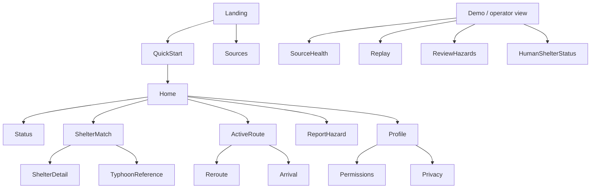
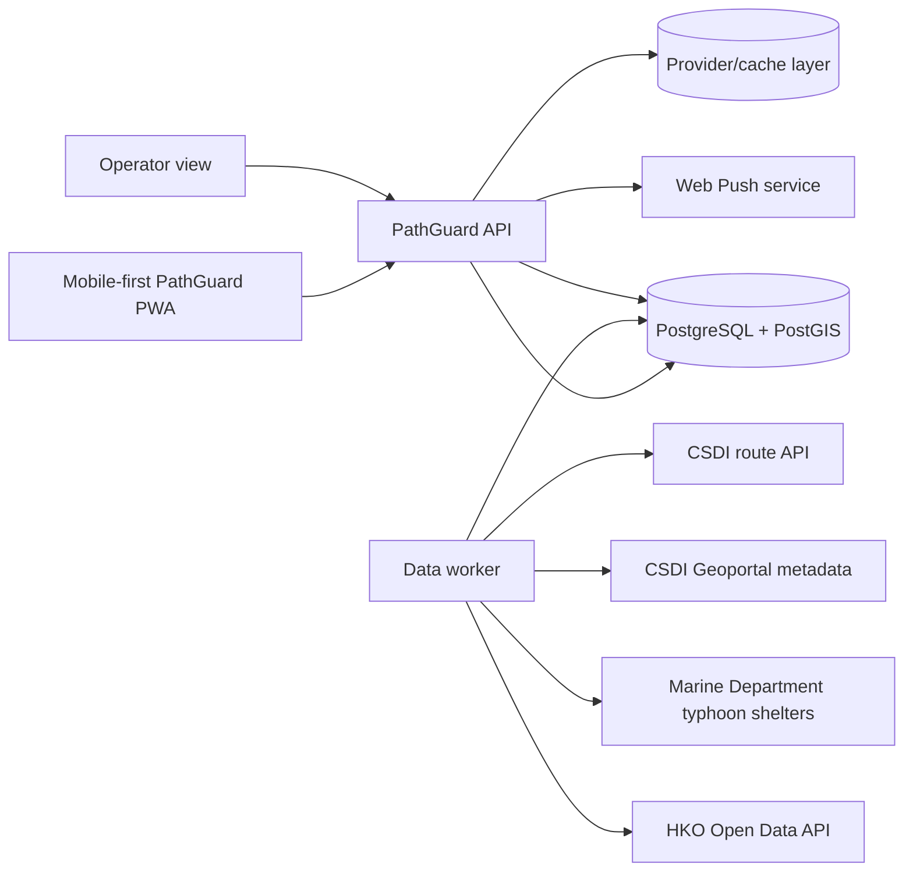

# PathGuard — Hong Kong Mobile-First Prototype Plan

> **Status:** Planning only. This document defines the hackathon prototype scope, integrations, UX, architecture, implementation order, and validation criteria. It is intentionally smaller and more honest than a production emergency-management system.
>
> **Revision:** Hong Kong official-data integration, mobile-first PWA delivery, deterministic safety logic, and hackathon scope reduction.

## 0. Executive brief

### Product
PathGuard is an accessible emergency-navigation web app for people who may not be able to use an ordinary walking route during a typhoon, severe rain, flooding, lift failure, or blocked footpath.

The prototype answers one question:

> **“Given my needs, the current official conditions, and the pedestrian route available from my location, which verified human shelter can I try to reach, and what should I do next?”**

PathGuard presents official information and navigation support. It does **not** issue emergency warnings, replace the Hong Kong Government or Hong Kong Observatory, guarantee physical safety, or dispatch emergency services.

### Prototype target
- **Geography:** Hong Kong. The demo should use one small, clearly named pilot area for reliable route coverage and fast testing; the data adapters should not hard-code that area.
- **Primary surface:** responsive mobile web app, installable as a PWA where supported.
- **Secondary surface:** small desktop/tablet operator view for data status, hazard review, and demo controls.
- **Languages:** English and Traditional Chinese are the baseline UI languages. Cantonese speech/content is a separate decision and must not be implied by browser speech synthesis.
- **Data mode:** live official-source reads where practical, cached official snapshots when necessary, and a clearly labelled replay mode for deterministic demos and tests.
- **Safety approach:** deterministic rules, source provenance, freshness indicators, explicit unknown states, and human-readable explanations. No conversational assistant or autonomous decision-maker is required for this prototype.

### Source links
1. [CSDI 3D Pedestrian Route Search API](https://hosting.csdi.gov.hk/csdi-webpage/apidoc/3d-pedestrian-route-search) — Lands Department point-to-point pedestrian route search across supported 3D indoor and outdoor environments.
2. [CSDI Geoportal metadata portal](https://portal.csdi.gov.hk/geoportal/#metadataInfoPanel) — discovery and metadata source for the 3D pedestrian network and related spatial datasets.
3. [Marine Department Typhoon Shelters resource](https://data.gov.hk/en-data/dataset/hk-md-hydro-typhoon-shelters/resource/fab4e8a7-148b-4827-a73d-5e3bc168d7ad) — API resource describing the location of typhoon shelters.
4. [Hong Kong Observatory Open Data](https://www.hko.gov.hk/en/abouthko/opendata_intro.htm) — official open-data catalogue and API documentation entry point for weather and typhoon-related products.

### Source boundaries confirmed during planning
| Source | What PathGuard may use it for | What the plan must not assume |
|---|---|---|
| CSDI 3D route API | Request a point-to-point pedestrian route and preserve returned geometry, steps, levels, and provider identifiers where supplied | A generic pedestrian route is automatically wheelchair-safe, flood-safe, or open at the time of travel |
| CSDI Geoportal | Discover network metadata, coverage, coordinate reference systems, update information, and dataset identifiers | The metadata portal alone is a stable routing endpoint; endpoint/schema access needs an implementation spike |
| Marine Department typhoon shelters | Display a separate reference layer showing typhoon-shelter locations | A typhoon shelter is a public human evacuation shelter, has capacity/accessibility features, or is suitable as a destination |
| HKO Open Data | Ingest selected official weather/typhoon observations, warnings, and status products after product selection | One unspecified HKO feed supplies every needed warning, geometry, forecast, or evacuation instruction |

### Hackathon success criteria
The prototype is successful when a judge can use a real phone to:
1. Open or install the PWA and complete a quick accessibility profile.
2. Allow or deny location access and still continue using a manual location fallback.
3. See an official-source status with source name and update time.
4. Request a CSDI pedestrian route through the backend adapter.
5. See a verified human-shelter recommendation, route limitations, source freshness, and a deterministic “Why this?” explanation.
6. See typhoon-shelter locations as a separate reference layer without confusing them with the recommended human shelter.
7. View a warning/weather state derived from a selected HKO product or a labelled replay snapshot.
8. Continue with a cached text route when network, map tiles, push, vibration, or GPS is unavailable.
9. Demonstrate one verified hazard or operator annotation causing a route warning/replan.

---

# 1. Product scope and requirements

## 1.1 Problem statement

Hong Kong pedestrian routes can include stairs, footbridges, lifts, steep paths, narrow footways, indoor connections, flooded areas, and entrances that are not usable by every person. During a typhoon or severe-rain event, the fastest route is not necessarily the route a wheelchair user, older adult, blind user, or person with a sensory or cognitive need can understand or use.

PathGuard combines:
- official weather/typhoon information from HKO;
- CSDI pedestrian routing and network metadata;
- a separately verified human-shelter catalogue;
- a separate typhoon-shelter reference layer;
- verified/operator/user hazard annotations; and
- a mobile-first accessible interface.

The product must show what is known, what is stale, and what is unknown. It must never hide uncertainty behind a confident route label.

## 1.2 Goals

| ID | Goal | Prototype measure |
|---|---|---|
| G-1 | Make an emergency status perceivable and understandable | On tested Android and iOS phones, participants can identify the status and next action without relying on sound, colour, or vibration alone |
| G-2 | Recommend a usable, verified human shelter | No recommendation violates a configured hard constraint using the data available to the prototype; unknown attributes are visible |
| G-3 | Provide an understandable pedestrian route | Route includes source, timestamp, levels/vertical transitions where available, warnings, and a text alternative |
| G-4 | Respond to a changed condition | A hazard or destination-status update causes a deterministic warning or replan in the controlled demo |
| G-5 | Work as a mobile web app under imperfect conditions | The core flow remains usable after denied location permission, denied notifications, lost GPS, unavailable vibration, and temporary network loss |
| G-6 | Explain decisions without hidden automation | Every recommendation and rejection has structured evidence and a readable explanation |

## 1.3 In scope for the hackathon MVP

### User app
1. Quick start without an account.
2. Optional account/profile for saved accessibility needs.
3. English/Traditional Chinese UI shell.
4. Mobility, sensory, text-size, and alert-preference profile fields needed by the demo.
5. Browser geolocation with manual search/pin fallback.
6. HKO-derived status card using one or more selected official products.
7. CSDI route request through a server-side adapter.
8. Deterministic accessibility checks against available route/network/hazard attributes.
9. Recommendation from a small verified human-shelter catalogue.
10. Separate typhoon-shelter reference layer.
11. Hazard display and one-step hazard reporting.
12. Active route screen with large next-step card, text route, source/freshness labels, and manual position recovery.
13. Cached last plan and route for offline/read-only fallback.
14. Push notification registration where the browser/device supports it; in-app polling is the reliable fallback.
15. Deterministic “Why this shelter?” and “Why this route?” panels.

### Demo/operator surface
1. Source health and last-successful-fetch status.
2. Replay snapshot selector.
3. Small hazard/route-change control for the demo.
4. Human-shelter status override for the demo, with audit history.
5. Read-only view of active users/routes at aggregate level where practical.

## 1.4 Explicitly out of scope

- Native iOS or Android applications.
- Guaranteed background location tracking in a mobile browser.
- Guaranteed push delivery, vibration, or OS emergency priority.
- SMS, voice calls, or telecom emergency broadcast integration.
- Treating typhoon-shelter locations as human evacuation shelters.
- Full Hong Kong indoor mapping or complete building-management/lift integration.
- Whole-Hong-Kong offline vector/3D routing.
- A production-grade emergency operations centre.
- Automatic emergency-service dispatch.
- Open-ended conversational assistance, model-generated routing, or autonomous actions.
- Claims that PathGuard is an official warning issuer or a safety guarantee.
- Large-scale crowd-sourced accessibility mapping.

## 1.5 Users and roles

| Role | Prototype permissions |
|---|---|
| Guest | View source status, create a temporary profile, request a route, view shelters and typhoon-shelter reference points |
| User | Save profile, routes, reports, notification registration, and consent settings |
| Caregiver | Optional stretch feature; view only explicitly shared status/location/route |
| Reporter | Submit a hazard report with location, type, note, and optional photo |
| Reviewer/operator | Review reports, update demo shelter status, select replay data, inspect source health |
| Admin | Manage configuration and roles; sensitive profile reads require audit logging |

For the hackathon, guest mode and the main user route are more important than a complete account/caregiver system.

## 1.6 Data modes

| Mode | Purpose | UI treatment |
|---|---|---|
| Live | Calls approved official adapters and uses the latest successful normalized records | Shows source, fetched/issued time, and freshness state |
| Snapshot | Uses a versioned official-data snapshot to make the demo reliable | Shows “Official snapshot” and snapshot timestamp |
| Replay | Replays a fixed event sequence and injected hazards | Persistent “REPLAY / DEMO DATA” banner; never presented as live |
| Offline | Uses only locally cached route, source metadata, and last plan | Shows data age and clear limitations; disables actions that need current data |

Every record must carry `mode`, `source_name`, `source_record_id` where available, `fetched_at`, `issued_at` where applicable, `valid_until` where applicable, `source_version`, and `freshness_state`.

## 1.7 Safety and product rules

1. **Official warnings remain official.** HKO content is displayed with attribution and provenance; PathGuard does not rewrite it into an official order.
2. **Human shelters and typhoon shelters are different entities.** Only the verified human-shelter catalogue may be used for destination matching.
3. **Unknown is not yes.** Missing width, slope, lift, entrance, capacity, or opening data cannot be silently treated as accessible or available.
4. **CSDI route semantics are preserved.** The UI must distinguish “CSDI pedestrian route returned” from “accessibility checks passed.”
5. **No route is an acceptable result.** The user receives the reason, a text fallback, shelter-in-place guidance, and an optional help action.
6. **Source freshness is part of the result.** Stale or unavailable data reduces confidence and is visible before the user starts moving.
7. **No destructive automation.** The system may display, recommend, notify, and request confirmation; it cannot dispatch emergency services or silently change a user’s destination except when the active destination is explicitly unavailable and the user confirms.
8. **User reports are not official facts.** They receive a trust state and do not override an official feed without review rules.

---

# 2. Functional requirements

Priority: **M** = must demonstrate; **S** = should implement if time permits; **C** = could be deferred.

## 2.1 Mobile shell and profile

| ID | Requirement | Acceptance criteria | Pri |
|---|---|---|---|
| FR-MOB-01 | The user app is mobile-first and responsive | At 320 px width through tablet width, the emergency flow has no horizontal scroll, clipped controls, or gesture-only action | M |
| FR-MOB-02 | The app is installable as a PWA where supported | Manifest, icons, service worker, install guidance, and update state are implemented; browser limitations are explained | M |
| FR-MOB-03 | The app handles permissions explicitly | Location, notifications, camera, and vibration permission states have granted, denied, dismissed, and unsupported UI states | M |
| FR-MOB-04 | The user can continue without location permission | User can search/select a location or drop a pin; the route result states that the position is manually supplied | M |
| FR-MOB-05 | The user can set a temporary profile | Guest can choose wheelchair/other mobility needs, stairs preference, vision/hearing needs, language, and text size without creating an account | M |
| FR-MOB-06 | The app supports English and Traditional Chinese strings | All user-facing strings are externalized; language can be changed without losing the active plan | M |
| FR-MOB-07 | The app caches the last useful result | Last route, shelter result, source timestamp, and text instructions can be opened offline/read-only | M |
| FR-MOB-08 | The app supports accessible interaction | Keyboard, screen reader, large text, high contrast, reduced motion, 48 px minimum touch targets, and readable focus states are tested | M |

## 2.2 Official data and source status

| ID | Requirement | Acceptance criteria | Pri |
|---|---|---|---|
| FR-DATA-01 | The backend has an adapter for CSDI 3D route search | Adapter validates requests/responses, applies timeout/rate limits, stores provider IDs, and records attribution/terms metadata | M |
| FR-DATA-02 | CSDI network metadata is registered | The selected pedestrian-network dataset has a recorded dataset ID, coverage, CRS, schema mapping, update information, and licence/attribution notes | M |
| FR-DATA-03 | The backend has an HKO adapter | At least one selected HKO typhoon/weather product is ingested into a normalized event/status model with source and issue/update times | M |
| FR-DATA-04 | The backend has a Marine Department typhoon-shelter adapter | API records are displayed as a separate location/reference layer; update time and provider are shown | M |
| FR-DATA-05 | Source health is visible | User/operator views show last successful fetch, data age, current freshness, and unavailable/stale state | M |
| FR-DATA-06 | Provider failure is safe | Timeout, malformed data, rate limiting, or outage does not produce a fabricated route, warning, shelter status, or freshness time | M |
| FR-DATA-07 | Official attribution is present | CSDI/LandsD and other provider attribution/terms required by the source are visible in the map/about/source panel | M |

## 2.3 Alerts and HKO information

| ID | Requirement | Acceptance criteria | Pri |
|---|---|---|---|
| FR-ALR-01 | The app displays selected HKO status/warning data | Card includes product name, source, issue/update time, validity where supplied, affected scope where supplied, and original-link attribution | M |
| FR-ALR-02 | The app separates official content from PathGuard guidance | Official text is visually labelled; PathGuard adds a separate plain-language “What you can do in this app” section | M |
| FR-ALR-03 | Status is multimodal | Visual banner, text, icon, optional speech, and optional vibration are available without any one channel being required | M |
| FR-ALR-04 | The app supports acknowledgement locally | User can acknowledge, request help, or dismiss with a reason; state is timestamped when online and queued if offline | M |
| FR-ALR-05 | Push is best effort | If push is unavailable or denied, the app uses in-app refresh/polling and explains that browser alerts cannot be guaranteed | M |
| FR-ALR-06 | Alerts do not strobe | Motion respects reduced-motion settings and remains below the planned flash threshold; static high-contrast treatment is always available | M |

## 2.4 Human shelter matching

| ID | Requirement | Acceptance criteria | Pri |
|---|---|---|---|
| FR-SHL-01 | The system stores a separate human-shelter catalogue | Each record has authority/source, coordinates, name, address, accessibility fields, operating status, capacity state if verified, and last verification time | M |
| FR-SHL-02 | Typhoon-shelter records cannot enter human-shelter ranking | Database type and service-level checks prevent a Marine Department typhoon-shelter record from being selected as a human evacuation destination | M |
| FR-SHL-03 | Hard constraints are deterministic | A shelter lacking a required verified feature, closed status, or usable route is excluded or marked partial with a visible reason | M |
| FR-SHL-04 | Ranking uses route evidence | Candidates are ranked using returned route time/distance, accessibility evidence, hazard state, source freshness, and facility match—not straight-line distance alone | M |
| FR-SHL-05 | The result explains its decision | User can see selected source records, hard filters, score factors, freshness, and why nearer candidates were rejected | M |
| FR-SHL-06 | The user can choose an alternative | At least two alternatives are shown when available; selecting one requests a new route and records the choice | S |
| FR-SHL-07 | Stale shelter data is visible | Stale/unknown fields are marked and cannot be presented as verified current capacity or accessibility | M |

## 2.5 CSDI routing, hazards, and rerouting

| ID | Requirement | Acceptance criteria | Pri |
|---|---|---|---|
| FR-RTE-01 | The app requests a CSDI pedestrian route | Origin and destination are validated; response is stored with provider request ID/version, geometry, steps, levels, and timestamp where supplied | M |
| FR-RTE-02 | The app handles 3D/vertical route information | Indoor/outdoor transitions, levels, stairs, lifts, ramps, and footbridges are represented when returned or known from overlays | M |
| FR-RTE-03 | The app runs local safety checks | Available route/network attributes are checked against the profile; unsupported checks are reported as unknown, not passed | M |
| FR-RTE-04 | Hazards affect route presentation | Verified blocked hazards warn or invalidate affected segments; pending reports are shown with trust state and configurable penalty | M |
| FR-RTE-05 | The route screen has a text alternative | Each step contains plain language, distance, direction/level where available, source time, and a map segment when possible | M |
| FR-RTE-06 | The app handles provider failure | CSDI timeout/error produces a retry, cached route if available, manual-help action, and no fabricated route | M |
| FR-RTE-07 | The app supports changed conditions | A verified hazard, lift-status change, or destination-status change marks the route for recheck and displays the reason | M |
| FR-RTE-08 | GPS loss has a recovery path | User can manually confirm their current location or restart from the last known point with an accuracy warning | M |
| FR-RTE-09 | Route language is honest | The UI says “CSDI pedestrian route” and separately reports accessibility checks; it does not call a route “safe” when required attributes are unknown | M |

## 2.6 Reporting, privacy, and optional caregiver support

| ID | Requirement | Acceptance criteria | Pri |
|---|---|---|---|
| FR-HZD-01 | User can report a hazard in three short steps | Type, location, and optional note/photo; one-handed and screen-reader usable; offline reports queue locally | M |
| FR-HZD-02 | Hazard records have provenance and trust | Every report includes source type, created time, review state, expiry/reconfirmation time, and reviewer history | M |
| FR-HZD-03 | Reviewer can verify, reject, resolve, or expire a report | Action is audited and affects route overlays only according to the trust policy | M |
| FR-PRV-01 | Location sharing is consent-based | User chooses whether to share status, location, or route; pause takes effect immediately in the app | M |
| FR-PRV-02 | Profile data is minimized | Guest profile is session-only; sensitive saved fields are separated and access logged | M |
| FR-CGV-01 | Caregiver status sharing is optional | If implemented, it supports consented status/location/route permissions and shows last-seen time; it is not required for the core demo | S |

---

# 3. User experience and information architecture

## 3.1 Core mobile journey

1. **Open:** Landing page states that PathGuard supplements official information.
2. **Set needs:** Quick start asks only the profile questions needed for route checks.
3. **Set location:** Use browser location, search, or map pin.
4. **Check status:** Show HKO source status, data age, and a clear disclaimer.
5. **Choose destination:** Show verified human shelters first; show typhoon shelters only in a separately named reference layer.
6. **Review route:** Show CSDI route, accessibility checks, level changes, hazards, source timestamp, and “Why this?” evidence.
7. **Navigate:** Show one large next action, text route, map, current data age, and help/report controls.
8. **Recover:** Handle GPS/network/provider failure with manual position, cached route, text route, or no-route guidance.

## 3.2 Sitemap



## 3.3 Required mobile pages

| Page | Required content and states |
|---|---|
| Landing | Value proposition, official-source disclaimer, Get started, Sources, accessibility statement |
| Quick start | Mobility/sensory/text-size questions, English/Traditional Chinese switch, guest-data explanation |
| Permission setup | Location, notifications, camera, vibration; granted/denied/unsupported fallbacks |
| Home | HKO status, source/freshness chip, location state, recommended next action, offline/replay banner |
| Shelter match | Human-shelter recommendation, alternatives, route time, freshness, why selected/rejected |
| Shelter detail | Authority, address, status, verified features, last updated, route action; never infer missing fields |
| Route | Large next step, text list, map, hazards, level transition, source/freshness, report/help |
| Reroute | What changed, source, new first step, accept/choose alternative, stale/error state |
| Typhoon-shelter reference | Clearly titled reference map/list, Marine Department source, no “go here” recommendation action |
| Report hazard | Three steps, location confirmation, optional photo/note, queued/offline state |
| Profile/settings | Needs, language, text size, notifications, privacy, delete/clear guest session |
| Sources/about | CSDI, Geoportal, Marine Department, HKO, human-shelter source, timestamps, attribution and limitations |
| Operator view | Source health, snapshot/replay mode, hazard review, human-shelter demo status, audit history |

## 3.4 Mobile behavior requirements

- Design from 320 px width upward; primary actions remain in the thumb zone.
- Use a bottom navigation only outside an active emergency route. During navigation, keep one persistent “I need help” or “Exit route” control.
- Never use a map as the only route representation. Provide an ordered text list and screen-reader landmarks.
- Do not require long press, multi-finger gesture, precise dragging, or colour-only interpretation.
- Request permissions at the moment they are useful, not on first paint.
- Keep the active route usable in foreground after screen-lock/background limitations are explained.
- Show a service-worker update prompt that does not interrupt an active route.
- Use Web Speech API only as optional read-aloud support; speech language availability is device-dependent.
- Use vibration only as an enhancement; visual and text equivalents always remain.
- Compress images, lazy-load maps, and defer non-critical operator assets on mobile.

## 3.5 Content and status vocabulary

Every source-backed card uses:

> **Source → What it says → Issued/updated → Validity/freshness → What PathGuard can do**

Required labels:
- `Official HKO information`
- `CSDI pedestrian route`
- `Official snapshot`
- `Community report — unverified`
- `Operator annotation`
- `Typhoon shelter reference — not a human evacuation shelter`
- `Accessibility unknown`
- `Route unavailable`
- `Offline — showing cached information`
- `REPLAY / DEMO DATA`

---

# 4. Technical architecture

## 4.1 Recommended stack

| Layer | Prototype choice | Reason |
|---|---|---|
| Mobile web | TypeScript, React, Vite, PWA service worker | Fast hackathon iteration, responsive components, installability |
| Map | MapLibre or another approved map renderer | Accessible styling and route overlays; confirm tile/data terms before use |
| Backend | Python FastAPI with Pydantic | Provider adapters, validation, simple typed API |
| Database | PostgreSQL + PostGIS | Source records, shelter geometry, hazard intersections, audit |
| Cache | IndexedDB in browser; small server cache | Offline last-plan support and provider-response protection |
| Background jobs | One worker process | Fetch HKO/data sources, normalize records, expire stale records |
| Live updates | In-app polling first; SSE if time permits | More reliable prototype fallback than assuming push/background execution |
| Push | Web Push with VAPID where supported | Best-effort notification enhancement, never the sole alert path |
| Testing | Playwright, axe, pytest, Lighthouse, provider contract fixtures | Mobile/browser/accessibility and data-contract coverage |

The architecture stays intentionally small: provider adapters, deterministic matching/routing checks, source status, and mobile fallbacks are the only decision-making components required for the prototype.

## 4.2 System context



## 4.3 Provider adapter rules

Every adapter implements:

```text
fetch() -> raw response + request metadata
validate(raw) -> provider-specific validated object
normalize(validated) -> PathGuard source record
publish(record) -> idempotent upsert + provenance
health() -> last success, latency, error, freshness
```

### CSDI route adapter

- Use the official 3D Pedestrian Route Search API as the route provider.
- Keep the provider call server-side so credentials, rate limits, retries, attribution, and schema changes are controlled.
- Preserve origin, destination, request time, provider response ID/version if supplied, geometry, steps, distance, duration, level/elevation/vertical information, and raw-response hash.
- Reject malformed or incomplete responses; never convert a failed provider response into a straight-line or fabricated route.
- Add a local overlay validation phase for known hazards, verified shelter entrances, lift states, stairs, ramps, and profile constraints.
- Respect the provider’s request-volume guidance and terms. Include required Lands Department logo/copyright attribution in the map experience where required by the provider terms.
- Confirm the exact request format, authentication requirements, quotas, error codes, coordinate reference systems, and route-response fields in the first implementation spike.

### CSDI pedestrian-network metadata adapter

- Use the Geoportal to identify the relevant 3D Pedestrian Network and 3D Indoor Network metadata.
- Record dataset title, identifier, owner, coverage, CRS, geometry/level semantics, update date/frequency, download/API endpoint, licence, and attribution.
- Treat the Geoportal page as discovery/metadata until a stable machine-readable endpoint is confirmed.
- Do not build a second synthetic pedestrian graph as the main route source. A small synthetic fixture is allowed only for automated tests and replay failure cases.

### HKO adapter

- Select the minimum HKO products required for the demo: one current weather/status product and one typhoon/warning-related product if the official API provides it for the intended scenario.
- Record the exact product names, endpoint URLs, response schema, units, language fields, update interval, issue/validity fields, and attribution in `docs/data-sources/hko.md`.
- Normalize official data into `weather_status`, `official_warning`, or `official_event` records without claiming that every product contains a map polygon.
- Preserve original HKO text and links. PathGuard’s simplified text is a separate, clearly labelled interpretation.
- If the required warning product cannot be reliably selected during the spike, use a versioned official snapshot and label the demo accordingly.

### Marine Department typhoon-shelter adapter

- Import the Data.gov.hk API resource as `typhoon_shelter_reference` records.
- Store provider, resource ID, name/identifier if supplied, geometry, fetched time, source update time, and raw-response hash.
- Display the records on a separate reference map/list.
- Do not add capacity, accessibility, opening status, human shelter facilities, or destination ranking fields unless a separate authoritative source supplies them.

### Human-shelter catalogue

A separate catalogue is required for recommendations. The team must identify and cite an authoritative Hong Kong source or create a small manually verified demo catalogue with an explicit “prototype fixture” label. Each record requires:

- human-shelter type and authority;
- name, address, coordinates, entrances, and contact if approved;
- opening/status and capacity fields only when sourced;
- accessibility features with `yes`, `no`, or `unknown` plus verification date;
- source URL, source record ID, licence/attribution, and freshness;
- manual verification notes for the demo area.

If no authoritative human-shelter source is available by the data-freeze milestone, the app must say “verified prototype shelter catalogue” rather than implying citywide official coverage.

## 4.4 Normalized data model

Core tables/entities:

```text
source_registry
- id, name, authority, base_url, terms_url, attribution_text
- refresh_policy, last_success_at, last_error, status

source_records
- id, source_id, source_record_id, record_type
- raw_hash, source_version, fetched_at, issued_at, valid_until
- freshness_state, geometry, normalized_payload, validation_errors

official_events
- id, source_record_id, kind, severity, title, original_text
- simplified_text, area_geometry_nullable, issued_at, valid_until, status

human_shelters
- id, source_record_id, authority, name, address, geometry
- status, capacity_state, last_verified_at, verification_notes

human_shelter_features
- shelter_id, feature, state, source_record_id, verified_at, notes

advisory_typhoon_shelters
- id, source_record_id, name, geometry, provider, fetched_at

routes
- id, user_or_guest_session, origin, destination, profile_snapshot
- provider, provider_request_id, status, requested_at, expires_at
- geometry, steps_json, distance_m, duration_s, levels_json
- accessibility_check_state, source_record_id, response_hash

hazards
- id, type, geometry, severity, effect, trust_state
- source_type, source_record_id, created_at, expires_at, reviewed_at

route_hazard_impacts
- route_id, hazard_id, affected_segment, effect, computed_at

profiles
- id/session_id, mobility, avoid_stairs, vision, hearing
- text_scale, language, alert_preferences

consents_and_devices
- notification/location/caregiver consent, browser capability flags, timestamps

audit_log
- actor, action, entity, before, after, request_id, created_at
```

Important modelling rules:
- `advisory_typhoon_shelters` and `human_shelters` are different tables/types and cannot be joined into one destination list by accident.
- All external values have provenance and timestamps.
- `unknown` is a first-class value for accessibility, capacity, status, and route capabilities.
- Raw provider responses are retained only as needed for debugging and source terms; normalized records are the application contract.
- Guest profiles and location data have short retention.

## 4.5 Deterministic matching and explanation

1. Filter to `human_shelters` only.
2. Exclude known closed/unavailable destinations.
3. Apply the selected profile’s hard requirements only where the data is known.
4. Request/lookup a CSDI route for each viable candidate within the demo limit.
5. Apply hazard overlays and route-level validation.
6. Rank by route duration, route accessibility evidence, hazard impact, facility match, freshness, and proximity.
7. Return the top result, alternatives, rejected candidates, and structured evidence.

Example explanation object:

```json
{
  "selected": "route_time_and_verified_step_free_entry",
  "evidence": [
    "CSDI returned a pedestrian route in 14 minutes",
    "the route avoids one verified blocked segment",
    "the destination has a verified step-free entrance"
  ],
  "unknowns": ["lift status last verified 42 minutes ago"],
  "rejected": [
    {"shelter": "Example A", "reason": "stairs-only entrance"},
    {"shelter": "Example B", "reason": "no current route after flood hazard"}
  ],
  "template_version": "explanation-v1"
}
```

The explanation is generated from structured data and reviewed templates. It must not invent missing facts.

## 4.6 Mobile reliability and fallback matrix

| Failure | Required behavior |
|---|---|
| Location denied | Search/pin location; label manual origin |
| GPS unavailable/low accuracy | Show accuracy; allow manual confirmation; do not imply turn-by-turn precision |
| HKO unavailable | Show last successful update and data age; never fabricate current status |
| CSDI unavailable | Show cached route if available; otherwise no-route/provider-unavailable state |
| Typhoon-shelter API unavailable | Hide or mark reference layer stale; human-shelter matching is not silently populated from it |
| Map tiles unavailable | Text route remains available; map shows unavailable state |
| Push denied/unsupported | In-app polling/refresh and visible notification limitation |
| Vibration unsupported | Visual/text/speech alternatives |
| Offline after route created | Read-only cached route, source age, last known hazards; no claim of current status |
| Service worker update | Non-blocking update prompt; preserve active route state |

## 4.7 API surface

All application calls use `/api/v1`; the browser does not call provider APIs directly.

| Method/path | Purpose |
|---|---|
| `POST /guest/sessions` | Create temporary profile session |
| `GET /sources/status` | Source health, freshness, attribution, mode |
| `GET /official-status` | Normalized HKO status/warnings |
| `GET /shelters/human` | Verified human-shelter catalogue |
| `GET /shelters/typhoon-reference` | Separate Marine Department reference layer |
| `POST /routes/plan` | Match candidates and request provider routes |
| `GET /routes/{id}` | Current route, source, checks, freshness, hazards |
| `POST /routes/{id}/position` | Foreground position update |
| `POST /routes/{id}/recheck` | Recheck route after a changed condition |
| `POST /hazards/reports` | Create user hazard report |
| `GET /hazards?bbox=...` | Read active hazards and trust states |
| `PATCH /operator/hazards/{id}` | Review/resolve hazard |
| `PATCH /operator/human-shelters/{id}` | Demo status/verification update |
| `POST /operator/replay/select` | Select snapshot/replay mode |
| `GET /operator/audit` | Read audit entries |
| `POST /me/devices` | Register supported push capability |
| `POST /me/acknowledgements` | Record status acknowledgement/help action |

Provider credentials, raw rate-limit details, and unstable provider schemas stay behind the backend adapters.

## 4.8 Security, privacy, and compliance

- HTTPS in all deployed environments; provider credentials in environment/secrets storage.
- Validate every provider response against a strict schema and reject unexpected geometry/coordinates.
- Rate-limit guest route requests, reports, source refreshes, and operator actions.
- Sanitize hazard notes and strip photo EXIF metadata.
- Encrypt saved contact/location/profile fields where retained; do not log them in application logs.
- Use consent records for location, notifications, and caregiver sharing.
- Keep guest/session data short-lived and delete it on session expiry.
- Audit operator overrides and source-normalization changes.
- Follow CSDI/LandsD terms, attribution, and logo/copyright requirements before public deployment.
- Review Hong Kong privacy and data-protection obligations before collecting real participant data; use synthetic/demo profiles during the hackathon.

---

# 5. Delivery plan for a hackathon

The team should build one reliable vertical slice before adding secondary features.

## Milestone 0 — Confirm contracts and setup

| Task | Output |
|---|---|
| Confirm CSDI route request/response/auth/quota/terms | `docs/data-sources/csdi-route.md` and a recorded sample response |
| Identify CSDI network metadata and CRS/coverage | `docs/data-sources/csdi-network.md` |
| Select exact HKO products/endpoints | `docs/data-sources/hko.md` and normalized fixture |
| Confirm Marine Department API response and update semantics | `docs/data-sources/typhoon-shelters.md` |
| Identify/cite human-shelter catalogue | `docs/data-sources/human-shelters.md` |
| Create React/Vite PWA, FastAPI API, PostGIS, CI | Running skeleton and health endpoint |
| Confirm pilot area and test phones | Device matrix and map coverage note |

**Gate:** no implementation claims a provider field until its sample response and terms are recorded.

## Milestone 1 — Mobile shell and source status

- Build Landing, Quick Start, Home, Sources, and permission states.
- Add English/Traditional Chinese string infrastructure.
- Add service worker, manifest, install prompt, IndexedDB cache, offline banner, and update state.
- Implement source registry/status API and source/freshness chips.
- Implement HKO adapter using selected product fixtures.
- Implement Marine Department typhoon-shelter reference adapter and separate map/list.

**Demo checkpoint:** a phone can open the PWA, deny location/notifications, select a manual point, and see official/snapshot source states without false freshness.

## Milestone 2 — Human-shelter matching and CSDI route

- Import the verified human-shelter catalogue.
- Implement CSDI route adapter through the backend.
- Store provider response provenance and route geometry/steps.
- Build deterministic hard checks, unknown states, candidate ranking, and explanation templates.
- Build Shelter Match, Shelter Detail, and Route pages.
- Add text-only route and cached route.

**Demo checkpoint:** a judge can compare at least two human shelters, see why one is chosen, open the CSDI route, and distinguish the typhoon-shelter reference layer.

## Milestone 3 — Hazards and changed conditions

- Add hazard reporting, moderation/review, expiry, and route overlay.
- Add replay snapshot with a verified blocked segment or operator annotation.
- Implement route recheck and changed-condition notice.
- Add manual position recovery and provider failure states.

**Demo checkpoint:** a route changes or becomes unavailable for a visible, source-labelled reason, with a text fallback.

## Milestone 4 — Accessibility and mobile hardening

- Test Android Chrome and iOS Safari/PWA behavior.
- Test VoiceOver, TalkBack, keyboard, screen-reader ordering, 200% text, high contrast, reduced motion, and device rotation.
- Test location/notification/camera/vibration denial and unsupported states.
- Test slow 4G and offline after route creation.
- Add attribution, limitations, privacy, and source pages.

**Gate:** no critical accessibility issue, no source without provenance, no live/replay ambiguity.

## Milestone 5 — Demo packaging

- Prepare a stable official snapshot and a replay fixture.
- Verify three complete runs on a real phone.
- Record source timestamps and API health before the presentation.
- Prepare a short fallback video/screenshots in case an external provider is unavailable.
- Keep all live claims scoped to the selected pilot area and recorded source coverage.

---

# 6. Testing and validation

## 6.1 Test layers

| Layer | Required checks |
|---|---|
| Unit | Normalizers, freshness, profile constraints, matching scores, explanation templates |
| Provider contract | CSDI, Geoportal metadata, HKO, and Marine Department fixtures; malformed/timeout/rate-limit responses |
| Integration | PostGIS geometry, source records, shelter type separation, hazard intersections, cache behavior |
| Browser E2E | Quick start, permissions, source view, shelter match, route, offline, report, replay |
| Accessibility | axe plus manual VoiceOver/TalkBack/NVDA/keyboard/200% zoom/reduced motion |
| Mobile device | Android Chrome and iOS Safari/PWA; foreground/background, install, notifications, vibration, speech, camera |
| Performance | First useful mobile render, route request latency split by provider/backend, cache behavior; report measured values instead of promising provider SLAs |
| Security | Authorization, rate limits, provider secret protection, upload validation, data deletion, operator audit |
| Usability | At least one representative accessibility review before the demo; report limitations honestly |

## 6.2 Critical test cases

| ID | Scenario | Expected result |
|---|---|---|
| TC-01 | User denies location permission | Manual search/pin flow works and origin is labelled manual |
| TC-02 | User denies notifications | In-app refresh/polling remains available; no false “push enabled” state |
| TC-03 | HKO response is stale or unavailable | Last update and limitation are shown; no current warning is fabricated |
| TC-04 | CSDI route request succeeds | Provider/source/timestamp, route steps, geometry, and levels are shown where supplied |
| TC-05 | CSDI route request times out | Cached route or clear unavailable state; no straight-line route substitution |
| TC-06 | Route lacks wheelchair-relevant attribute | Result says accessibility is unknown; it is not marked verified accessible |
| TC-07 | Candidate is a Marine Department typhoon shelter | It appears only in the reference layer and cannot be selected as a human shelter |
| TC-08 | Human shelter has stairs-only verified entrance | Wheelchair profile excludes it and shows the structured reason |
| TC-09 | Human-shelter status becomes unavailable | Active plan is rechecked and user sees a changed-condition notice |
| TC-10 | Verified hazard intersects route | Route warning/recheck appears with hazard provenance and time |
| TC-11 | User goes offline after receiving a route | Cached text route opens with source age and read-only limitation |
| TC-12 | Vibration/speech unsupported | Visual/text equivalent remains usable |
| TC-13 | Text scale reaches 200% | No clipped content or horizontal scrolling in core flow |
| TC-14 | Traditional Chinese selected | Core flow strings, status labels, source labels, and errors are translated |
| TC-15 | Replay mode selected | Persistent replay banner appears and live claims are disabled or clearly separated |
| TC-16 | Operator changes a demo shelter status | Change is audited, labelled as an operator annotation, and affects ranking deterministically |

## 6.3 Acceptance checklist

- [ ] Official source names and links are visible.
- [ ] Every external record has source and time metadata.
- [ ] CSDI route attribution and terms requirements are implemented.
- [ ] Typhoon shelters cannot be confused with human evacuation shelters.
- [ ] Human shelter catalogue authority and limitations are documented.
- [ ] Live, snapshot, replay, and offline states are visually distinct.
- [ ] Mobile core flow works with location and notifications denied.
- [ ] Cached text route works after temporary network loss.
- [ ] No route or stale data produces a confident unsafe recommendation.
- [ ] English and Traditional Chinese core strings are complete.
- [ ] Accessibility review has no unresolved critical issues.
- [ ] Demo has been run three times on real phones.

---

# 7. Demo script

1. Open PathGuard on a phone and show the responsive/PWA entry point.
2. Switch between English and Traditional Chinese or show the completed language state.
3. Deny location permission, select a manual origin, and explain the fallback.
4. Show HKO official status with source and update time.
5. Open the shelter comparison: verified human shelters are ranked; a candidate is rejected for a known accessibility constraint.
6. Open the selected CSDI pedestrian route and show its source, level/vertical information, hazards, and text route.
7. Open the separate typhoon-shelter reference layer and explicitly state that these locations are not being used as human evacuation destinations.
8. Start navigation and demonstrate the large next-step mobile layout.
9. Trigger a replay/operator hazard annotation; show the route recheck and deterministic reason.
10. Turn off connectivity or simulate provider failure; show cached text instructions and the limitation state.
11. End with the source/limitations page: PathGuard supports official information and route planning but does not issue official orders or guarantee safety.

---

# 8. Risks and mitigations

| Risk | Impact | Mitigation |
|---|---|---|
| CSDI contract, quota, or coverage is unsuitable | Critical | Complete provider spike first; cache approved snapshots; keep a truthful unavailable state |
| CSDI route lacks accessibility attributes | Critical | Separate route result from accessibility validation; use verified local overlays; expose unknowns |
| HKO product selected does not support intended warning flow | High | Select and fixture exact products early; do not invent polygons/semantics |
| Typhoon-shelter data is misunderstood | Critical | Separate entity/type, UI, tables, API, tests, and demo script |
| No authoritative human-shelter catalogue is available | Critical | Use a small explicitly labelled verified prototype catalogue; do not imply full coverage |
| External API unavailable during judging | High | Official snapshot plus replay mode; show source age and mode honestly |
| PWA push/background GPS limitations | High | Foreground-first design, polling, manual refresh, cached text route, clear permission states |
| Accessibility data becomes stale | High | Verification timestamp, unknown state, source health, conservative matching |
| Mobile map is too slow or inaccessible | High | Text route as primary fallback, lazy map loading, real-device testing |
| Scope expands beyond hackathon capacity | High | Protect the vertical slice; defer caregiver, full operator console, and large-scale reporting |
| Personal/sensitive data is mishandled | Critical | Guest-first demo, synthetic profiles, minimization, consent, short retention, audit |

---

# 9. Decisions and open questions

## Decisions for the team to lock before coding

| ID | Decision | Recommended answer |
|---|---|---|
| D-01 | Pilot geography | One named Hong Kong district or route corridor with confirmed CSDI coverage |
| D-02 | Languages | English + Traditional Chinese UI; Cantonese speech is not promised unless separately tested |
| D-03 | Human-shelter source | One cited authoritative source or a clearly labelled manually verified prototype catalogue |
| D-04 | HKO products | One current status/weather product plus one selected typhoon/warning product, exact endpoints recorded |
| D-05 | CSDI integration mode | Backend adapter with caching, rate limiting, provenance, and required attribution |
| D-06 | Live versus snapshot | Live where stable; official snapshot and replay are mandatory fallbacks for the presentation |
| D-07 | Mobile baseline | Android Chrome and iOS Safari; PWA installation tested but not required for every browser |
| D-08 | Guest mode | Include in MVP to remove account friction during the demo |
| D-09 | Caregiver features | Stretch only after the core route flow is stable |
| D-10 | Offline promise | Read-only cached route and source age; no offline claim of current official status |

## Verification questions before final implementation

1. What are the exact CSDI route request parameters, response fields, quotas, authentication requirements, and terms for the selected use?
2. Which CSDI/Geoportal pedestrian-network dataset and CRS cover the pilot area?
3. Which HKO API products provide the intended warning/status information, and what are their update/validity semantics?
4. Does the chosen human-shelter catalogue provide current accessibility and operating data, or must the demo label it as a verified fixture?
5. What map tiles and basemap attribution may be used with the CSDI route display?
6. Which Android/iOS versions and browsers will be used for the live demo?
7. Which data may be cached, for how long, and under what source terms?

---

# 10. Documentation structure for implementation

```text
docs/
  data-sources/
    csdi-route.md
    csdi-network.md
    hko.md
    typhoon-shelters.md
    human-shelters.md
  accessibility-test-matrix.md
  mobile-permissions-and-fallbacks.md
  api-contract.md
  data-provenance-and-freshness.md
  privacy-and-retention.md
  demo-runbook.md
  decisions.md
  traceability.md
```

The implementation must update these documents when a provider field, source, route assumption, mobile capability, or safety rule changes.
